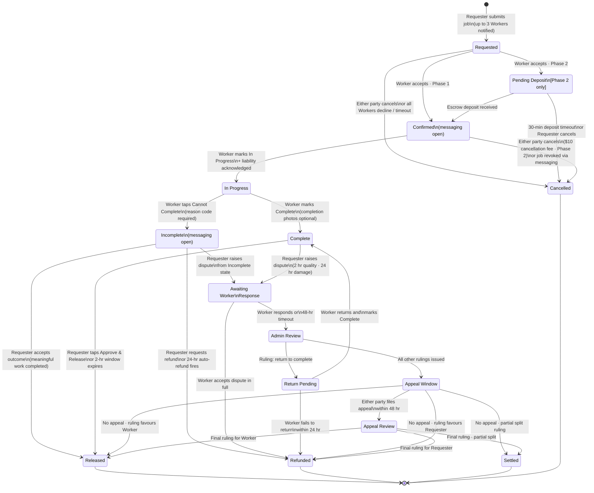

# Use Cases
## SnowReach — Neighbourhood Snow Clearing Marketplace
**Version:** 1.0
**Date:** 2026-03-28
**Status:** Draft
**Companion document:** REQUIREMENTS.md v1.8

---

## 1. Actors and Personas

### 1.1 Worker Personas

Workers are defined by two independent dimensions: **who performs the work** (personally vs.
assigned to a third party) and **how far they will travel** (nearby only / has car / willing
to travel far). The cross-product produces six personas.

| ID | Name | Performs Work | Range | Key Characteristics |
|----|------|:---:|------|---------------------|
| W1 | **Walker** | Personally | 0–2 km | No vehicle; walks with snowblower from home; strictly range-limited; lowest overhead |
| W2 | **Local Driver** | Personally | 0–10 km | Has a car; self-performs; moderate range; can serve a suburban cluster |
| W3 | **Traveler** | Personally | 0–25 km (+ 10% buffer opt-in) | Has a car; willing to drive significant distances; likely activates the radius buffer to catch jobs just beyond their stated max |
| W4 | **Nearby Dispatcher** | Third party | 0–2 km | Assigns work to a crew member or sub-contractor; does not personally perform work; crew is local |
| W5 | **Mobile Dispatcher** | Third party | 0–10 km | Assigns crew; has vehicle logistics to deploy crew across a moderate service zone |
| W6 | **Regional Dispatcher** | Third party | 0–25 km (+ 10% buffer opt-in) | Assigns crew across a large area; may run a small snow-clearing business; buffer opt-in likely active |

> **Dispatcher note (W4/W5/W6):** In v1, all platform actions (accept, In Progress, Complete,
> dispute response) are performed by the dispatcher's account regardless of who physically
> performed the work. Crew sub-accounts are deferred to a future version (see Gap G-04).

### 1.2 Requester Personas

Requesters are defined by property size and clearing scope.

| ID | Name | Property Type | Typical Scope |
|----|------|--------------|---------------|
| R1 | **Condo Owner** | Small — condo, townhouse, semi-detached | Small driveway or parking pad; front walk only; single access point |
| R2 | **Homeowner** | Medium — standard detached residential | Full driveway, front walk, front steps; possibly side path |
| R3 | **Estate Owner** | Large — large residential lot, corner lot | Long driveway, multiple walkways, corner sidewalk obligations, multiple access points; longest jobs, highest fees |

### 1.3 Platform Actor

| ID | Name | Role |
|----|------|------|
| A1 | **Administrator** | Dispute arbitration; ruling authority; platform configuration; fraud review |

---

## 2. Scope and Version Flags

Each use case carries a phase and version tag. Key constraints on scope:

| Tag | Meaning |
|-----|---------|
| **v1** | Available at initial release |
| **v1.1** | Deferred from v1; earliest next release (e.g., tips) |
| **v2** | Second major version (e.g., fee negotiation, native apps) |
| **Phase 1** | Simplified payments — no escrow hold; payment collected post-completion |
| **Phase 2** | Full escrow — deposit held at confirmation; Pending Deposit state active |
| **Both** | Applies in both payment phases |

**Critical v1 limitation — timing and fee negotiation:**
In v1, there is no in-app messaging and no structured scheduling mechanism. The Requester
communicates desired timing via the job notes field (free text only). Fee is non-negotiable:
the Worker sets their distance-tier prices on their profile; the Requester either accepts
those prices by selecting the Worker or selects a different Worker. Fee negotiation (counter-
offer / accept / reject) is a v2 feature. See Gap G-01.

---

## 3. Actor–Activity Matrix

| Activity | W1 | W2 | W3 | W4 | W5 | W6 | R1 | R2 | R3 | A1 |
|----------|:--:|:--:|:--:|:--:|:--:|:--:|:--:|:--:|:--:|:--:|
| 1. Register on app | X | X | X | X | X | X | X | X | X | — |
| 2. Find possible Workers | — | — | — | — | — | — | X | X | X | — |
| 3. Select Worker | — | — | — | — | — | — | X | X | X | — |
| 4. Negotiate timing and fee *(v1: read-only; v2: counter-offer)* | X | X | X | X | X | X | X | X | X | — |
| 5. Accept or reject work | X | X | X | X | X | X | — | — | — | — |
| 6. Abandon / complete / fail to complete work | X | X | X | X | X | X | — | — | — | — |
| 7. Acknowledge or dispute completion | — | — | — | — | — | — | X | X | X | X |
| 8. Feedback and tip *(tip: v1.1)* | X | X | X | X | X | X | X | X | X | — |

---

## 4. Use Cases

Use cases are grouped by activity. Persona-specific variations are noted inline rather than
duplicated as separate use cases. The standard format is:

> **UC-XX · Name** · Version/Phase · Primary Actors
> Preconditions | Main Flow | Alternate Flows | Postconditions | Persona Variations

---

### Group A — Registration and Onboarding

---

**UC-01 · Register as Requester** · v1 · Phase 1 & 2 · **R1, R2, R3**

**Preconditions:**
- User has not previously registered.
- User's property address is within an active SnowReach launch zone.
- User is 18 years of age or older.

**Main Flow:**
1. User navigates to SnowReach and selects "Sign up as a Requester."
2. User chooses registration method: email/password, Google, or Apple.
3. User completes profile: full name, property address (geocoded on entry).
4. System validates address is within an active launch zone.
5. User enters date of birth; system verifies age ≥ 18.
6. User checks the Age Verification acknowledgement (Appendix B).
7. User reads and actively accepts Terms of Service and Privacy Policy (Appendix C).
8. User adds a valid payment method (credit/debit card via Stripe).
9. Account is created; Requester dashboard is shown.

**Alternate Flows:**
- **AF-1** — Address outside all active launch zones: system presents the register-interest
  page; account is created but marked inactive for matching until their zone launches.
- **AF-2** — Address geocoding fails: system falls back to postal code FSA, then to
  neighbourhood dropdown. If all fail, user is shown an error and prompted to re-enter.
- **AF-3** — Email already registered: prompt to log in or reset password.
- **AF-4** — DOB indicates age < 18: registration rejected with explanation.
- **AF-5** — Payment method fails Stripe validation: user prompted to re-enter;
  registration completes without payment method but Requester cannot submit job requests
  until a valid method is added.

**Postconditions:**
- Requester account created; ToS/Privacy Policy acceptance timestamped and stored.
- Requester can browse Workers and post job requests (if payment method is on file).

**Persona Variations:**
- **R1:** Property type auto-tagged "Small" based on address + postal code lookup where
  possible; Requester can correct during profile setup.
- **R3:** System may prompt "We noticed this appears to be a corner lot — please indicate
  all access points that require clearing." This populates a saved scope template for
  future job posts.

---

**UC-02 · Register as Personal Worker** · v1 · Phase 1 & 2 · **W1, W2, W3**

**Preconditions:**
- User has not previously registered as a Worker.
- User owns or has access to snow clearing equipment.
- User is 18 years of age or older.

**Main Flow:**
1. User selects "Sign up as a Worker" (or adds Worker role to existing account).
2. User completes profile: full name, home/base address (private — never shown to
   Requesters).
3. User declares equipment type (snowblower, shovel, truck-mounted plow, other — free text
   if not listed).
4. User sets distance/price tiers (up to three tiers: distance boundary + price per tier).
   Minimum price per tier is $20 CAD.
5. User sets maximum service radius (1–25 km). Outermost tier cannot exceed this radius.
6. User optionally enables the 10% radius buffer (off by default). A tooltip explains:
   *"When on, you may receive job offers up to 10% beyond your maximum radius. Each such
   offer will be clearly labelled with the actual distance."*
7. User connects a Stripe account for payment receiving (required before accepting jobs).
8. User enters date of birth; system verifies age ≥ 18.
9. User accepts Age Verification acknowledgement (Appendix B), ToS, and Privacy Policy.
10. User completes mandatory onboarding module (Phase 2+; deferred in Phase 1).
11. User completes insurance declaration (Phase 3+; deferred in Phase 1 and 2).
12. User verifies phone number (required before first accepted job).
13. Account is activated; Worker dashboard shown with status set to Available.

**Alternate Flows:**
- **AF-1** — Stripe connection fails: account created; Worker cannot accept jobs until
  Stripe is connected. System prompts reconnection on next login.
- **AF-2** — Equipment type not listed: free-text field accepted; flagged for Admin review
  (no impact on activation).
- **AF-3** — DOB indicates age < 18: registration rejected.
- **AF-4** — Launch zone: Worker is registered but marked inactive for matching until their
  base address falls within an active launch zone.

**Postconditions:**
- Worker account created; profile saved; tiers and radius configured.
- Worker is visible in search results for Requesters in their zone and range (once zone
  is active and phone is verified).

**Persona Variations:**
- **W1 (Walker):** User selects "No vehicle — I walk to jobs." System caps the max service
  radius field at 2 km and hides vehicle-related equipment options. Buffer opt-in toggle
  is shown but grayed out (no practical benefit at ≤ 2.2 km effective range).
- **W3 (Traveler):** User sets a large radius (e.g., 20 km). Buffer opt-in toggle is
  prominently shown; likely to be enabled. System shows the effective radius with buffer
  (e.g., "Your effective range with buffer: up to 22 km").

---

**UC-03 · Register as Dispatcher (Third-Party Worker)** · v1 · Phase 1 & 2 · **W4, W5, W6**

**Preconditions:**
- User operates as a dispatcher: they do not personally perform the clearing work but
  assign it to crew members or sub-contractors.
- All preconditions from UC-02 apply.

**Main Flow:**
1. Same as UC-02, steps 1–6 and 8–12.
2. At step 3, user selects "I assign work to crew members / sub-contractors."
3. System enables the Dispatcher profile fields:
   - Crew size (approximate number of workers available).
   - Crew member names (v1: free-text list, stored for on-site disclosure purposes).
4. User is informed that for every job, they must disclose any crew member performing
   work at the Requester's property before work begins (FR-LIAB-03/04).
5. Remaining steps as UC-02.

**Alternate Flows:**
- **AF-1** — Crew size set to zero: system warns "You have indicated no crew. Please add
  at least one crew member or switch to Personal Worker registration."
- All other alternate flows from UC-02 apply.

**Postconditions:**
- Dispatcher account created. Crew list stored in profile.
- Dispatcher is shown as "Dispatcher" type on their public profile, giving Requesters
  advance notice that the job may be performed by someone other than the account holder.

**Persona Variations:**
- **W4 (Nearby Dispatcher):** Service radius capped at 2 km; crew is local.
- **W6 (Regional Dispatcher):** Buffer opt-in likely active; crew may be spread across
  multiple sub-zones. v1 does not track crew locations — dispatcher manages this offline.

---

### Group B — Job Posting and Discovery

---

**UC-04 · Post a Snow Clearing Job** · v1 · Both Phases · **R1, R2, R3**

**Preconditions:**
- Requester is logged in with a verified address and a valid payment method on file.
- Requester's address is within an active launch zone.

**Main Flow:**
1. Requester selects "Post a Job."
2. Property address is pre-populated from profile; Requester may select a different address
   (e.g., an elderly parent's home — address verified against launch zone).
3. Requester selects scope of work (checkboxes): driveway, front walk, side path, steps,
   corner sidewalk.
4. Requester enters timing notes in a free-text field (e.g., "ASAP," "Before 8am please").
   *(v1: this is the only timing mechanism — no scheduling or negotiation. See Gap G-01.)*
5. Requester optionally uploads up to 5 scoping photos with a short description (max 500
   characters) to indicate specific areas or concerns.
6. System displays the pricing applicable from Workers in the area (based on their tiers
   and approximate distance) before the Requester proceeds to Worker selection.
7. Requester reviews the escrow/payment process explanation and confirms they understand
   the payment model.
8. Requester taps "Find Workers" and proceeds to UC-05.

**Alternate Flows:**
- **AF-1** — No Workers available in range: system informs Requester and offers options:
  check back later, expand scope to Workers with buffer opt-in, or register interest for
  additional supply in their zone.
- **AF-2** — Address outside launch zone: request is rejected; Requester redirected to
  register-interest page.
- **AF-3** — Photo upload failure: non-blocking; job can be posted without photos. System
  notes the upload failure and prompts a retry.

**Postconditions:**
- Job draft created in system with scope, photos, and timing note attached.
- Requester is taken to the Worker list (UC-05).

**Persona Variations:**
- **R1:** Scope checklist has "small driveway" and "front walk" pre-selected based on
  property type tag. Fewer options visible; job creation is fast.
- **R3:** Corner lot and multiple-access-point checkboxes appear. System displays a
  caution: *"Large-scope jobs may not be suitable for all Workers. Consider selecting a
  Dispatcher Worker with crew capacity."* Estimated job duration and suggested price range
  are higher. See Gap G-03 regarding partial completion of large-scope jobs.

---

**UC-05 · Browse and Filter Available Workers** · v1 · Both Phases · **R1, R2, R3**

**Preconditions:**
- Job draft created (UC-04 complete).
- At least one Worker is within range and Available.

**Main Flow:**
1. System displays the Worker list: Workers within range of the job address, sorted by
   (1) rating descending, (2) acceptance rate descending (Workers with ≥ 5 completed jobs),
   (3) distance ascending.
2. Each Worker card shows: name, profile photo, aggregate rating (stars + number of
   ratings), distance from job address (approximate), price for this job (based on their
   applicable tier), equipment type, dispatcher badge (if applicable), buffer-zone badge
   (if they appear via the buffer), and availability status.
3. Requester may filter by: equipment type, maximum price, personal vs. dispatcher.
4. Requester taps a Worker card to view their full profile (UC-06).
5. Requester selects up to 3 Workers by tapping "Add to Request" on each profile.
   A persistent selection tray shows selected Workers (1 of 3 / 2 of 3 / 3 of 3).
6. Requester taps "Send Request" to proceed to UC-07.

**Alternate Flows:**
- **AF-1** — Fewer than 3 Workers available: Requester may send to 1 or 2.
- **AF-2** — Buffer-opt-in Worker appears beyond stated range: card displays "Extended
  Range — X.X km (outside their usual area)." Requester may select them normally.
- **AF-3** — No Workers available: system returns to the no-coverage state from UC-04 AF-1.

**Postconditions:**
- Up to 3 Workers selected and queued for simultaneous request dispatch.

**Persona Variations:**
- **R1:** Short list; nearby W1/W2/W4 Workers likely dominate.
- **R3:** System may surface W3/W6 (buffer opt-in) Workers specifically with the extended
  range badge. The Requester should be aware these Workers are travelling further and the
  job window may need to accommodate travel time — this is communicated via the
  distance display only; no formal scheduling mechanism exists in v1 (Gap G-01).

---

**UC-06 · View Worker Profile** · v1 · Both Phases · **R1, R2, R3**

**Preconditions:**
- Worker list is displayed (UC-05).

**Main Flow:**
1. Requester taps a Worker card.
2. Full profile displayed: name, photo, equipment, service radius, pricing tiers, aggregate
   rating, all ratings and review text (publicly visible — Requester and Worker ratings both
   shown), number of completed jobs, dispatcher badge, trust badges (Phase 2+: onboarding;
   Phase 3: background check, insured), buffer opt-in status.
3. Requester taps "Add to Request" or "Back."

**Alternate Flows:**
- **AF-1** — Worker has zero completed jobs: "New Worker" badge shown. No rating displayed;
  rating field shows "No ratings yet."
- **AF-2** — Worker has dropped below 4.0 rating threshold: Admin-review flag is not shown
  to Requesters (internal only); the rating is displayed accurately and speaks for itself.

**Postconditions:**
- Requester has enough information to make an informed selection decision.

---

### Group C — Job Selection, Booking, and Acceptance

---

**UC-07 · Send Job Request to Selected Workers** · v1 · Both Phases · **R1, R2, R3**

**Preconditions:**
- 1–3 Workers selected (UC-05).
- Requester has confirmed scope, timing note, and photos.

**Main Flow:**
1. Requester taps "Send Request."
2. System simultaneously dispatches the job request to all selected Workers.
3. Job status changes to **Requested**.
4. Each selected Worker receives a notification with: job scope, Requester's aggregate
   rating (so Worker can make an informed decision), approximate distance, job price
   (per their applicable tier), Requester's timing note.
5. A 10-minute acceptance window begins. A countdown is visible to the Requester.
6. System waits for a response (UC-09).

**Alternate Flows:**
- **AF-1** — Requester cancels while Requested: job → **Cancelled**; Workers notified.
- **AF-2** — A Worker's availability changed between selection and dispatch (just went
  Unavailable): that Worker is skipped; remaining Workers receive the request. If none
  remain, Requester is returned to the Worker list.

**Postconditions:**
- Job is in **Requested** state. 10-minute window is live.

---

**UC-08 · Complete Escrow Deposit** · Phase 2 only · v1 · **R1, R2, R3**

**Preconditions:**
- A Worker has accepted the job (UC-09 complete).
- Job is in **Pending Deposit** state.

**Main Flow:**
1. Requester receives immediate notification: *"[Worker name] has accepted your job.
   Please deposit $[amount] to confirm."*
2. Requester is shown a summary: job scope, Worker name, total price, commission disclosure
   (15% already included in price), cancellation fee policy disclosure ($10 if cancelled
   after confirmation), property damage acknowledgement (Appendix C reference).
3. Requester actively acknowledges the property damage policy (checkbox).
4. Requester authorises payment via their saved Stripe payment method.
5. Stripe processes the escrow hold. Job status → **Confirmed**.
6. Exact addresses of both parties are disclosed to each other via the job confirmation
   screen and email.

**Alternate Flows:**
- **AF-1** — 30-minute deposit window expires without payment: job → **Cancelled**;
  Worker's status restored to Available; Worker notified.
- **AF-2** — Stripe payment fails: Requester prompted to retry or use a different payment
  method. Timer continues running.
- **AF-3** — Requester cancels during the deposit window: job → **Cancelled**; Worker
  notified; no funds involved.

**Postconditions:**
- Job is in **Confirmed** state. Funds held in escrow. Both addresses disclosed.
- Requester's property damage acknowledgement stored immutably in the job record.

---

**UC-09 · Accept or Reject a Job Request** · v1 · Both Phases · **W1–W6**

**Preconditions:**
- Worker has received a job request notification (UC-07 complete).
- Worker's status is Available.
- The 10-minute window has not expired and the job has not been filled by another Worker.

**Main Flow:**
1. Worker opens the notification showing: job scope, Requester aggregate rating, approximate
   distance from Worker's address, applicable price (from Worker's own tier for this
   distance), timing note, and scoping photos (if provided).
2. Worker reviews details.
3. Worker taps **"Accept"** → job proceeds based on phase:
   - Phase 1: job → **Confirmed** immediately; addresses shared.
   - Phase 2: job → **Pending Deposit**; Worker is notified that Requester must deposit
     within 30 minutes.
4. All other selected Workers are immediately notified: *"This job has been filled."*
   Their non-response (since they didn't get a chance) does not count toward their
   non-response counter.

**Alternate Flows:**
- **AF-1 — Worker declines:** Worker taps "Decline." Job remains in Requested state for
  remaining Workers. Active decline is recorded for analytics (FR-ANLT-01); no penalty.
- **AF-2 — 10-minute window expires:** Job treated as a non-response for this Worker.
  If 3 consecutive non-responses have occurred, Worker's status is set to Unavailable
  (FR-WORK-15). Requester is returned to the Worker list (minus already-contacted Workers).
- **AF-3 — Job already filled before Worker acts:** Worker opens notification to find
  *"This job has been accepted by someone else."* No action available. This non-response
  does not count toward the Worker's counter (FR-WORK-17).
- **AF-4 — Buffer zone job:** Worker sees banner: *"Extended Range Job — [X.X] km. This
  is outside your usual service radius."* Worker must explicitly tap "Accept Anyway" rather
  than the standard "Accept" button.

**Postconditions:**
- Job is in Confirmed (Phase 1) or Pending Deposit (Phase 2) state.
- Accepting Worker's status automatically changes to Busy.
- Other Workers contacted are released.

**Persona Variations:**
- **W4/W5/W6 (Dispatchers):** The "Dispatcher" badge is visible on the Worker card and
  profile (FR-WORK-19), so Requesters already know sub-contracting is possible before
  selecting. Crew member disclosure happens at In Progress time (FR-LIAB-03/04), not at
  acceptance. Requesters who selected "Personal Worker only" filter will not see Dispatcher
  Workers at all.
- **W3/W6 (Buffer zone):** See AF-4. Explicit confirmation of extended travel is required.

---

**UC-10 · Negotiate Fee and Timing** · **v2 (Fee negotiation)** / **v1: read-only** · **W1–W6, R1–R3**

*In v1, this use case is restricted to information display only. There is no fee
negotiation mechanism and no structured timing coordination. Workers see the Requester's
timing note; Requesters see the Worker's set prices. If either party finds terms
unacceptable, the only recourse is to decline or select a different Worker.*

*In v2, the following flow is added:*

**Main Flow (v2):**
1. Worker reviews job and finds the current price insufficient for the scope or distance.
2. Worker submits a counter-offer: proposed price + optional note.
3. Requester receives counter-offer notification. Requester may: Accept, Reject, or
   Re-counter (up to 3 negotiation rounds).
4. If accepted: job proceeds to confirmation at the counter-offer price.
5. If rejected or round limit reached: Worker may accept the original price or the
   request expires.

**Gap reference:** Timing negotiation (scheduling) has no mechanism in any version to date.
See Gap G-01.

---

### Group D — Work Execution

---

**UC-11 · Begin Work (Mark In Progress)** · v1 · Both Phases · **W1–W6**

**Preconditions:**
- Job is in **Confirmed** state.
- Worker is at or en route to the property.

**Main Flow:**
1. Worker opens the active job in the app and taps "Start Job."
2. System displays the mandatory liability acknowledgement screen (FR-LIAB-01/02, Appendix A):
   *"By proceeding, you confirm that you accept full personal responsibility and liability
   for all work performed at this property, including the actions of any person assisting
   you or performing work on your behalf."*
3. Worker must actively check the acknowledgement checkbox (cannot be pre-selected).
4. If a dispatcher (W4/W5/W6) or if someone else is performing the work:
   Worker checks the secondary checkbox (FR-LIAB-03): *"Someone other than me will be
   performing or assisting with this work."*
   - System prompts for the on-site person's full name(s) (FR-LIAB-04).
   - Requester receives an immediate notification identifying who will be on-site.
5. Worker taps "Begin Work." Job status → **In Progress**. Timestamp recorded.
6. Requester receives notification: *"[Worker name / crew member name] has started your job."*

**Alternate Flows:**
- **AF-1** — Worker taps Start but is not yet at the property: no validation in v1.
  Timestamp is recorded as In Progress regardless of location (Gap G-02).
- **AF-2** — Requester cancels from Confirmed before Worker taps Start: job → **Cancelled**
  ($10 fee applies in Phase 2). Worker notified and status restored to Available.

**Postconditions:**
- Job is in **In Progress** state. Liability acknowledgement and on-site disclosure stored
  immutably in job record.

**Persona Variations:**
- **W1 (Walker):** No travel time indicator; arrival is self-reported; Requester notified
  when Worker taps Start.
- **W4/W5/W6 (Dispatchers):** On-site disclosure is expected and prompted. The crew
  member name entered here flows to FR-LIAB-05 (alert banner for Requester) and is stored
  in the job record.

---

**UC-12 · Complete Work (Mark Complete)** · v1 · Both Phases · **W1–W6**

**Preconditions:**
- Job is in **In Progress** state.
- Work has been completed or substantially completed.

**Main Flow:**
1. Worker taps "Mark Complete."
2. System optionally prompts to upload completion photos (up to 5). Upload is encouraged
   but not mandatory.
3. Worker taps "Confirm Completion." Job status → **Complete**.
4. Requester receives notification: *"Your job has been marked complete. You have 2 hours
   to raise a dispute about work quality, or 24 hours for property damage claims. If no
   dispute is raised, funds will be released automatically."*
5. The 2-hour quality window and 24-hour damage window both begin simultaneously.
6. Rating prompt is queued to send 1 hour after job reaches a terminal state.

**Alternate Flows:**
- **AF-1** — Photo upload fails (network issue): non-blocking. Job can be marked Complete
  without photos; completion record is flagged "No completion photos" visible to Admin and
  Requester. Worker is encouraged to retry.
- **AF-2** — Worker cannot complete the job: see UC-13.

**Postconditions:**
- Job is in **Complete** state. 2-hour quality and 24-hour damage windows are active.
  Requester has been notified.

**Persona Variations:**
- **W4/W5/W6 (Dispatchers):** Photo upload is especially important as evidence that
  the crew completed the job; the account holder uploads on behalf of the crew.
- **R3 jobs:** For large-scope jobs, Workers are encouraged to submit photos covering
  all access points. The system does not enforce this structurally in v1 (Gap G-03).

---

**UC-13 · Report Cannot Complete** · v1 · Both Phases · **W1–W6**

**Preconditions:**
- Job is in **In Progress** state.
- Circumstances prevent the Worker from finishing the job (equipment failure, safety
  concern, access blocked, weather, or other genuine reason).

**Main Flow:**
1. Worker taps **"Cannot Complete"** from the active job screen.
2. System presents a mandatory reason selection: Equipment failure / Safety concern /
   Property access blocked / Weather conditions / Other.
3. Worker selects a reason and optionally enters an explanatory note (max 500 characters).
4. Worker taps "Submit." The action is irreversible once confirmed.
5. Job status → **Incomplete**. Worker's status is immediately restored to Available.
6. Both parties are notified. Requester sees: *"[Worker] has reported they cannot complete
   this job. You have 24 hours to choose how to proceed."*
7. The in-app messaging thread (UC-19) remains open for both parties to discuss.
8. Requester's resolution screen shows three options with a 24-hour countdown:
   - **Accept outcome** — releases payment to Worker (used when meaningful work was done
     and Requester is satisfied with what was completed).
   - **Request refund** — full escrow refund to Requester; no fault assigned; no dispute.
   - **Raise a dispute** — formal dispute process (UC-15) if Requester believes the
     Cannot Complete was avoidable or Worker was negligent.
9. Cannot Complete incident recorded in Worker's record with reason code and resolution
   outcome (FR-JOB-14, FR-ANLT-22).

**Alternate Flows:**
- **AF-1 — Requester takes no action within 24 hours:** Auto-refund fires. Job → **Refunded**.
- **AF-2 — Requester selects Dispute:** Dispute type pre-set as "Incomplete work." The
  Worker's Cannot Complete reason code and note are included in the evidence package.
  Flow proceeds per UC-15.
- **AF-3 — Worker goes completely silent** (no Cannot Complete, no Complete, job stalls):
  Admin monitoring (FR-BOOT-10) surfaces the stalled job during soft launch. Requester
  contacts support. Admin intervenes manually. This is an edge case — the Cannot Complete
  button is the expected mechanism, not silence.

**Postconditions:**
- Job is in **Incomplete** state. Messaging thread active. Requester has 24 hours to choose.
- Worker's Cannot Complete rate (FR-ANLT-22) updated. If this is the 3rd incident in 90
  days, Admin review flag is automatically created (FR-JOB-14).

**Persona Variations:**
- **W4/W5/W6 (Dispatchers):** Cannot Complete most commonly arises from crew
  unavailability (crew member fails to show). The dispatcher submits the report; the
  account holder remains fully responsible. Reason code "Other" or "Safety concern"
  covers crew no-show in v1.

---

### Group E — Completion Acknowledgement and Dispute

---

**UC-14 · Acknowledge Completion** · v1 · Both Phases · **R1, R2, R3**

**Preconditions:**
- Job is in **Complete** state.
- Requester has been notified.

**Main Flow (Requester approves):**
1. Requester opens the completion notification and reviews the job record including Worker's
   completion photos (if any).
2. Requester taps **"Approve & Release"** to release funds immediately.
3. Job status → **Released**. Funds disbursed:
   - Phase 1: Requester's card is charged; Worker receives 85% within 2–3 business days.
   - Phase 2: Escrowed funds released; Worker receives 85% within 2–3 business days.
4. Rating prompt sent to both parties 1 hour later.

**Alternate Flows:**
- **AF-1 — Auto-acknowledgement:** Requester takes no action within the 2-hour quality
  window (no dispute filed). System automatically releases funds. Job → **Released**.
  Rating prompt fires 1 hour later.
- **AF-2 — Requester initiates dispute:** See UC-15.

**Postconditions:**
- Job is in **Released** state. Payment disbursed. Rating prompts queued.

**Persona Variations:**
- **R3 (Estate Owner):** Large-scope jobs may require inspection of multiple access
  points before the Requester can confidently approve. The 2-hour quality window and
  24-hour damage window accommodate this; however, there is no structured partial
  acknowledgement mechanism in v1. If some access points were cleared and others were
  not, the Requester's only options are full approval or dispute (Gap G-03).

---

**UC-15 · Initiate and Process a Dispute** · v1 (Phase 1 simplified) / Phase 2 (full) · **R1–R3, W1–W6, A1**

**Preconditions:**
- Job is in **Complete** state.
- Requester is within the dispute window (2 hours for quality; 24 hours for property damage).

**Main Flow:**

*Stage 1 — Dispute Initiation (Requester):*
1. Requester taps "Raise a Dispute."
2. Requester selects dispute type: incomplete/unsatisfactory work, property damage, or both.
3. Requester submits: written description of the issue and up to 5 supporting photos.
4. Job status → **Disputed**. Escrowed funds frozen (Phase 2) / payment collection paused
   (Phase 1). Both parties notified.

*Stage 2 — Worker Response (48 hours):*
5. Worker receives dispute notification and has 48 hours to respond.
6. Worker may either:
   - **a.** Submit a response: written account of events, up to 5 supporting images,
     and optionally a proposed settlement amount.
   - **b.** Accept the dispute in full: Worker agrees to a complete refund to Requester.
     This is irrevocable and triggers immediate Refund disbursement. Job → **Refunded**.
7. If Worker does not respond within 48 hours: non-response flagged; case proceeds to
   Admin Review automatically.

*Stage 3 — Admin Review (up to 5 business days):*
8. Admin receives a system-compiled evidence package: original job request and photos,
   completion photos, dispute description and photos, Worker response (if submitted),
   full job timeline, on-site personnel disclosure, Worker history
   (dispute rate, prior outcomes), Requester history (dispute filing rate, prior outcomes),
   any fraud flags on either account.
9. Admin issues one of five rulings:
   - **Full payment to Worker:** dispute rejected; 85% to Worker, 15% to App Owner.
   - **Full refund to Requester:** dispute upheld; 100% to Requester; no commission.
   - **Partial split:** proportional award; Worker receives (their %) × 85%.
   - **Return to complete:** Worker must return within 24 hours to finish; funds held.
   - **Increased payment:** Admin invites Requester to authorise a voluntary additional
     charge (Requester must consent; cannot be compelled — Appendix C).
10. Both parties receive the ruling with a written explanation.

*Stage 4 — Return to Complete (if applicable):*
11. If "Return to complete" ruling: Worker is notified with a 24-hour deadline.
12. Worker returns, marks In Progress (liability reacknowledged), marks Complete.
13. New 2-hour quality window opens; Requester may approve or re-dispute.
14. If Worker fails to return within 24 hours: ruling converts to full refund to Requester.

*Stage 5 — Appeal Window (48 hours after ruling):*
15. Either party may file one appeal within 48 hours, stating specific grounds: new
    evidence, procedural error, or factual error in the ruling.
16. If no appeal: ruling is executed (funds disbursed). Job → **Released**, **Refunded**,
    or **Settled** depending on ruling.
17. If appeal filed: App Owner or senior Admin reviews. Best-effort 3-business-day target.
18. Final ruling issued. No further appeal permitted. Job → terminal state.

**Alternate Flows:**
- **AF-1 — Dispute window has expired:** system rejects the dispute attempt; Requester
  is shown the window that applied to their dispute type and informed funds have been
  released.
- **AF-2 — Worker accepts dispute in full (Stage 2b):** job bypasses Admin Review;
  immediate refund to Requester.
- **AF-3 — Requester declines increased payment (Stage 3):** Admin adjusts ruling to
  proceed on the basis of the original escrowed amount only.
- **AF-4 — Frivolous appeal:** appeal note recorded on account; may be considered in
  any future dispute proceedings.

**Postconditions:**
- Escrowed funds disbursed per ruling. Job in a terminal state (Released, Refunded,
  or Settled). Dispute record stored immutably for 7 years. Both parties' dispute rate
  metrics updated.

**Persona Variations:**
- **R3 large-scope disputes:** likely to involve partial completion (some areas done,
  some not). Admin must interpret photo evidence against the original scope checklist. v1
  has no structured partial-completion framework — Admin exercises judgement (Gap G-03).
- **W4/W5/W6 (Dispatchers):** Worker response must come from the account holder. Crew
  member accounts do not exist in v1; testimony from crew is informal (included in
  Worker's written response and photos). This is noted as Gap G-04.
- **Phase 1 (simplified):** No formal escrow hold. Dispute is handled manually by Admin
  with a charge/refund processed directly via Stripe rather than releasing a held amount.
  The process steps are the same; the payment mechanism differs.

---

**UC-16 · Cancel a Job** · v1 · Both Phases · **R1–R3, W1–W6**

**Preconditions:** Varies by cancellation state — see flows.

**From Requested (before any Worker accepts):**
1. Either party cancels. Job → **Cancelled**. No payment impact. Workers notified.

**From Pending Deposit (Phase 2 only — Worker accepted, deposit not yet made):**
1. Requester cancels during the deposit window. Job → **Cancelled**. No funds involved.
2. *Or* deposit window expires (30 minutes). Auto-cancellation. Worker notified; status
   restored to Available.

**From Confirmed (after deposit, before In Progress):**
1. Either party initiates cancellation.
2. Phase 2: $10 CAD cancellation fee deducted from escrow; remainder refunded to Requester
   within 2–3 business days.
3. Phase 1: Full refund (no fee in Phase 1 simplified model).
4. Job → **Cancelled**. Worker's status restored to Available.

**From In Progress or beyond:** Cancellation is not permitted. The dispute process (UC-15)
applies if either party is dissatisfied with the outcome.

**Worker-initiated cancel from Confirmed:**
1. Worker cancels from a Confirmed job. $10 fee applies (Phase 2).
2. Job → **Cancelled**. Requester must post a new job to find a replacement Worker.
3. Worker's cancellation rate metric updated (FR-ANLT-03).

**Postconditions:**
- Job is in **Cancelled** state. Applicable refunds processed.
- Both parties receive cancellation notifications.

**Persona Variations:**
- **R3 cancelling a confirmed job:** High-value cancellation; Admin dashboard surfaces
  these for awareness. No special policy in v1 — same rules apply.

---

### Group F — Feedback and Tip

---

**UC-17 · Leave Feedback and Rating** · v1 (rating) · v1.1 (tip) · Both Phases · **W1–W6, R1–R3**

**Preconditions:**
- Job has reached a terminal state (Released, Refunded, Settled, or Cancelled with work
  having started).
- 1-hour delay after terminal state has elapsed.

**Main Flow:**
1. Both parties receive a rating prompt simultaneously.
2. Each rates the other on a scale of 1–5 stars, with an optional written comment.
3. Ratings are collected independently. After both parties have submitted, or after 7 days
   (whichever comes first), ratings are published to both profiles simultaneously.
4. *(v1.1)* After submitting their rating, the Requester is shown an optional tip prompt
   (UC-18).

**Alternate Flows:**
- **AF-1 — One party does not submit within 7 days:** The non-submitting party's rating
  entry is marked "No rating submitted." The other party's rating is published regardless.
- **AF-2 — Rating submitted after a Cancelled job with no work performed:** System displays
  a warning: *"No work was recorded for this job. Are you sure you want to rate this
  interaction?"* Requester may proceed or dismiss.
- **AF-3 — Rating drops below threshold:** After submission, system backend checks the
  new aggregate. If below 4.0: Admin flag created. If below 3.5: account suspended from
  new jobs pending Admin review (after minimum 10 completed jobs).

**Postconditions:**
- Ratings published to both profiles. Worker's aggregate rating and ranking recalculated.
  Analytics metrics updated (FR-ANLT-06, FR-ANLT-09, FR-ANLT-11).

**Persona Variations:**
- **W4/W5/W6 (Dispatchers):** Rating is applied to the dispatcher account. Crew
  sub-accounts are out of scope (G-04 resolved via Personal/Dispatcher designation).
- **R3:** Review context (large property) is visible to future Requesters browsing the
  Worker's profile, helping them calibrate the rating appropriately.

---

**UC-18 · Leave a Tip** · **v1.1 only** · Both Phases · **R1, R2, R3**

**Preconditions:**
- Rating prompt has been shown (UC-17).
- Requester has submitted or skipped their rating.

**Main Flow:**
1. After the rating step, Requester sees an optional tip prompt with preset amounts (e.g.,
   $5, $10, $20) and a custom entry field.
2. Requester selects an amount or skips.
3. If a tip amount is selected: Stripe processes the tip immediately as a separate charge
   (not held in escrow; 100% to Worker; no platform commission applies to tips).
4. Worker receives a notification of the tip separately from the rating notification.
5. Tip amount is recorded in the job record for the Worker's dashboard.

**Alternate Flows:**
- **AF-1 — Tip payment fails:** Requester prompted to retry. Tip failure does not affect
  the job record, rating, or fund release.
- **AF-2 — Requester exits without tipping:** No tip recorded. No penalty. No follow-up
  prompt.

**Postconditions:**
- Tip recorded. Worker notified. 100% of tip amount disbursed to Worker within standard
  Stripe payout timeline.

---

**UC-19 · In-App Messaging and Job Revocation** · v1 · Both Phases · **W1–W6, R1–R3**

**Preconditions:**
- Job is in Confirmed state (Phase 2) or Worker has accepted (Phase 1).
- Job has not yet reached a terminal state.

**Main Flow — Normal Messaging:**
1. Both parties access the messaging thread from the job detail screen.
2. Either party types and sends text messages. Messages are delivered in real time via
   Firebase Firestore. New message notifications delivered in-app and by email.
3. A persistent notice is displayed within the thread: *"Do not share personal contact
   information (phone numbers, email addresses) in this conversation."*
4. Parties use messaging to coordinate: timing, access instructions, entry codes, scope
   clarifications, and any other job-specific logistics.
5. Thread remains active through all non-terminal job states.

**Alternate Flow A — Revoke Job via Messaging:**
1. Either party taps **"Revoke Job"** from within the messaging thread.
2. System presents a confirmation screen stating the applicable cancellation rules:
   - If job is Confirmed (before In Progress): *"Revoking this job will incur a $10
     cancellation fee (Phase 2) deducted from your escrow. The remaining balance will
     be refunded."*
   - If job is Requested: *"Revoking will cancel the job with no charge."*
3. Party actively confirms.
4. Job → **Cancelled** (per FR-JOB-09 rules for the current state). Thread archived.
5. Both parties notified of cancellation.

**Alternate Flow B — Thread during Incomplete State:**
1. Worker submits Cannot Complete (UC-13). Job → **Incomplete**.
2. Messaging thread remains open. Worker can explain the situation in more detail;
   Requester can ask questions before choosing a resolution.
3. Thread archives when the Incomplete state resolves to a terminal state.

**Alternate Flow C — Thread closed at terminal state:**
1. Job reaches Released, Refunded, Settled, or Cancelled.
2. Messaging thread is automatically closed to new messages.
3. Thread is archived as read-only. Both parties can access archived threads from
   their job history for the retention period.

**Postconditions:**
- All messages stored immutably in the job record for 7 years (FR-MSG-09).
- Messages included in the dispute evidence package for any dispute on this job (FR-MSG-09).
- Administrator can view any job's thread at any time (FR-MSG-10).

**Persona Variations:**
- **R3 (Estate Owner):** Messaging is particularly valuable for communicating access
  details for large properties — gate codes, which driveway entrance to use, priority
  areas — without sharing contact information.
- **W4/W5/W6 (Dispatchers):** Dispatcher can use messaging to communicate who will be
  arriving and their approximate ETA, supplementing the formal on-site disclosure at
  In Progress time. Requester can confirm they are comfortable with the crew member
  before work begins.

---

### Group G — Payment Exceptions

> These use cases cover failure modes in the payment lifecycle. The primary actors are the
> **system** (automated retry and escalation logic) and the **Administrator** (manual
> resolution authority). Workers and Requesters appear as affected parties. None of these
> flows require action from either party unless specifically noted.
>
> All payment operations use Stripe idempotency keys (FR-PAY-10); all timers use durable
> persistent scheduling (FR-PAY-13); all exceptions surface in the Admin Payment Exception
> Queue (FR-PAY-15, FR-PAY-16).

---

**UC-20 · Timer-Based Auto-Operation Failure** · v1 · Both Phases · **System, A1**

Three timers drive automatic state transitions in SnowReach. This use case covers what
happens when those timers fire correctly but the downstream payment operation fails, and
what happens if the timer itself fails to fire.

**Timers covered:**

| Timer | From State | To State | Window |
|-------|-----------|---------|--------|
| Auto-release | Complete | Released | 2 hr after marking Complete |
| Auto-cancel | Pending Deposit | Cancelled | 30 min after Worker acceptance |
| Auto-refund | Incomplete | Refunded | 24 hr after Cannot Complete |

**Main Flow — Normal (timers fire and payment succeeds):**
Already documented in UC-08 AF-2, UC-14 AF-1, and UC-13 AF-1. No exception.

**Alternate Flow A — Timer fires; payment operation fails:**
1. Timer fires at the correct time. System attempts the Stripe operation (release, cancel,
   or refund).
2. Stripe returns an error (5xx, timeout, or network failure).
3. System retries up to 3 times with exponential backoff (FR-PAY-14).
4. If all retries fail:
   - Job remains in its current state (Complete, Pending Deposit, or Incomplete).
   - A payment exception record is created in the Admin queue (FR-PAY-15).
   - Admin is alerted by email.
   - Job state label is updated to indicate "Payment Processing Delayed" (visible to Admin
     only; user-facing job view shows the same state with no change — users are not shown
     backend retry details to avoid confusion).
5. Admin reviews the exception and may: manually trigger the Stripe operation once Stripe
   recovers, extend the window (e.g., give the Requester more time if the auto-release
   failed due to an outage), or mark as resolved after manual intervention.

**Alternate Flow B — Timer fails to fire (platform restart / crash):**
1. Platform restarts or crashes while a timer is pending.
2. On startup, the durable scheduler recovers all pending timers from the database.
3. Timers that have already passed their fire time are executed immediately on recovery.
4. Timers that have not yet fired resume from their remaining duration.
5. No user-visible impact if recovery is prompt. If significant delay (e.g., platform
   was down for hours), the Admin is alerted of late-firing operations.

**Postconditions:**
- No timer-based transition is permanently lost.
- All failures surface in the Admin exception queue within minutes of occurrence.
- Users experience either a transparent auto-operation or an Admin-resolved delay;
  they are never left with permanently stuck job states.

---

**UC-21 · Stripe API Outage** · v1 · Both Phases · **System, A1, R1–R3, W1–W6**

**Preconditions:**
- The Stripe API is returning errors or timing out across all operations.
- The platform detects 3 or more consecutive API errors within a 5-minute window (FR-PAY-17).

**Main Flow — Outage detected:**
1. Platform sets itself to **Payment-Suspended** mode.
2. All pending Stripe operations (deposits, payouts, refunds) are queued internally.
3. All pending timers (auto-release, auto-cancel, auto-refund) are paused at their
   current remaining duration.
4. Admin is alerted immediately.

**Impact on active job states:**

| Job State | User-Visible Effect |
|-----------|-------------------|
| Requested | Unaffected — no payment involved yet. |
| Pending Deposit | Requester sees: *"Payment processing is temporarily unavailable. Your deposit is being held and will process as soon as service is restored. Your 30-minute window is paused."* |
| Confirmed / In Progress | Unaffected — no payment action needed until Complete. |
| Complete | Auto-release timer paused. Requester and Worker see no change; Admin is aware. |
| Incomplete | Auto-refund timer paused. Requester sees: *"Payment processing is temporarily unavailable. Your refund will be processed as soon as service is restored."* |
| Awaiting resolution / ruling | Unaffected — no payment action needed until ruling. |

**Recovery:**
1. Platform detects Stripe API responding normally (successful test call).
2. Platform exits Payment-Suspended mode.
3. Queued operations are executed in order (oldest first) with idempotency keys.
4. Paused timers resume from their remaining duration.
5. Admin receives a recovery notification.
6. Affected users may receive a notification: *"Payment processing has resumed. Your
   [deposit / refund / payment] is being processed now."*

**Postconditions:**
- No operations lost. No job permanently stuck. Admin has full visibility.
- Users experience a transparent delay; no incorrect charges or missed payments.

---

**UC-22 · Escrow Deposit or Post-Completion Charge Failure** · v1 · Both Phases · **R1–R3, System, A1**

**Preconditions:**
- Phase 2: Job is in Pending Deposit state; Requester initiates escrow deposit.
- Phase 1: Job is in Complete state; platform initiates post-completion charge.

**Phase 2 Main Flow — Escrow deposit fails:**
1. Requester authorises payment via their saved Stripe payment method.
2. Stripe returns a charge failure: card declined, card expired, insufficient funds,
   or fraud prevention block.
3. Platform displays the specific failure reason from Stripe (e.g., *"Your card was
   declined. Please try a different payment method."*).
4. Requester may retry with the same card or add/switch to a different card.
5. The 30-minute deposit window continues running through retries.
6. If the window expires without a successful payment: job → **Cancelled** (standard
   auto-cancel per FR-PAY-13); Worker notified and status restored to Available.
7. If the failure is persistent (card issuer hard-decline code): platform advises the
   Requester to contact their card provider; standard window-expiry outcome applies.

**Phase 1 Main Flow — Post-completion charge fails:**
1. Worker marks job Complete. Platform immediately attempts to charge the Requester's
   saved payment method.
2. Charge fails (card declined, expired, or other error).
3. Platform retries up to 3 times over a 24-hour window (FR-PAY-22).
4. If all retries fail:
   - Job is flagged as a **Payment Exception** in the Admin queue.
   - Requester is notified: *"Your payment for the completed job could not be processed.
     Please update your payment method."*
   - Admin is alerted.
   - Worker is notified of the delay and that the platform is pursuing payment on their
     behalf.
5. Admin contacts Requester. If the Requester updates their payment method: platform
   retries the charge. If unresolvable: Admin determines outcome (bad debt process).

> **Phase 1 risk note:** Because Phase 1 has no pre-job escrow, the Worker performs work
> before payment is secured. A permanent charge failure means the Worker may not be paid
> for completed work. This is a fundamental limitation of Phase 1 and a primary motivation
> for the Phase 2 escrow model (FR-PAY-22).

**Postconditions (Phase 2):** Job auto-cancelled after window; no funds at risk.
**Postconditions (Phase 1):** Payment exception open; Admin pursuing resolution; Worker
informed; outcome dependent on Requester's responsiveness.

---

**UC-23 · Worker Payout Failure** · v1 · Both Phases · **W1–W6, System, A1**

**Preconditions:**
- A disbursement has been authorised to the Worker (job Released or Settled).
- The Stripe Connect payout to the Worker's bank account fails.

**Causes:** Stripe Connect account not fully set up, bank account closed or rejected by
the receiving bank, Stripe account suspended, or bank-imposed return.

**Main Flow:**
1. Platform authorises a Stripe Connect transfer to the Worker's account.
2. Stripe returns a payout failure (may arrive immediately or as a delayed webhook event
   if the bank initially accepted then returned the transfer).
3. Platform creates a payment exception record in the Admin queue (FR-PAY-19).
4. Worker receives a notification: *"Your payout of $[amount] could not be delivered.
   Please check your payment details and update your Stripe account."*
5. Admin is alerted.
6. Worker updates their Stripe Connect account (e.g., adds a new bank account).
7. Worker taps "Retry Payout" from their account settings (or Admin triggers manually).
8. Stripe retries the transfer. If successful: funds delivered; exception closed.

**Alternate Flows:**
- **AF-1 — Worker does not respond within 90 days:** Funds remain held in Admin-controlled
  state. After 90 days, the matter is escalated to the App Owner's legal/compliance process
  (FR-PAY-19d). Worker's account may be suspended pending resolution.
- **AF-2 — Stripe Connect account suspended (platform violation):** Worker is advised to
  resolve the issue with Stripe directly before a retry can be attempted. Admin holds funds
  in the interim.
- **AF-3 — Bank hard return after initial acceptance:** The receiving bank returns the
  funds to Stripe days after the initial transfer. Stripe notifies the platform via
  webhook; platform detects the reversal, creates an exception, and follows the main
  flow from step 3.

**Postconditions:**
- Funds are never lost — held by Stripe/Admin until successfully delivered or legally
  resolved. Worker is informed at every step.

---

**UC-24 · Duplicate or Erroneous Charge** · v1 · Both Phases · **R1–R3, System, A1**

**Preconditions:**
- A Requester payment operation has been submitted to Stripe.
- A network timeout, client-side retry, or platform bug causes the same charge to be
  submitted a second time.

**Main Flow — Idempotency key prevents duplicate (standard case):**
1. First charge submitted with idempotency key `job-{id}-deposit-attempt-1`.
2. Network timeout occurs before platform receives Stripe's success response.
3. Platform retries with the **same** idempotency key.
4. Stripe recognises the idempotency key and returns the result of the original charge
   without creating a new one. No duplicate charge occurs.
5. No user impact.

**Alternate Flow — Duplicate charge despite idempotency (platform bug):**
1. Due to a platform bug, two charges with different idempotency keys are submitted for
   the same job deposit.
2. Both succeed at Stripe (two charges on Requester's card).
3. Platform detects the duplicate: same Requester, same job ID, same amount, within 5
   minutes (FR-PAY-21).
4. Platform immediately initiates a Stripe refund for the duplicate charge.
5. Requester is notified: *"We detected and automatically refunded a duplicate charge of
   $[amount]. You were only charged once."*
6. Admin receives an alert. Both charge IDs are logged for investigation.
7. Development team is notified of the bug via the incident log.

**Alternate Flow — Requester double-taps Pay button:**
1. Requester taps "Pay" twice quickly.
2. Client-side: the button is disabled after the first tap to prevent double submission.
3. If the double-tap bypasses the client guard (e.g., via direct API call): server-side
   idempotency key prevents the second charge from executing.
4. No duplicate charge.

**Postconditions:**
- Requester is made whole immediately if a duplicate occurs. No financial loss to any party.
- Duplicate events are logged and investigated. Patterns may indicate a recurring bug.

---

**UC-25 · Refund Processing Failure** · v1 · Both Phases · **R1–R3, System, A1**

**Preconditions:**
- A refund has been authorised to the Requester (dispute ruling, Cannot Complete
  auto-refund, or cancellation refund).
- The Stripe refund API call fails.

**Causes:** The original charge has been refunded more than Stripe allows (partial refunds
can exceed the original charge if misapplied), the Requester's card account has been
permanently closed, or the Stripe account has a refund limit applied.

**Main Flow:**
1. Platform submits refund to Stripe.
2. Stripe returns a refund failure.
3. Platform retries up to 3 times with exponential backoff (FR-PAY-14).
4. If all retries fail:
   - Payment exception record created in the Admin queue (FR-PAY-20).
   - Admin alerted.
   - Requester notified: *"We were unable to process your refund to your original payment
     method. Our team will contact you with an alternative within 2 business days."*
5. Admin contacts Requester and offers alternatives:
   - **Platform credit:** the refund amount is credited to the Requester's SnowReach
     account and applied automatically to their next job deposit.
   - **Manual bank transfer:** App Owner initiates a transfer to the Requester outside
     of Stripe (e.g., e-transfer). Requester provides banking details through a secure
     channel.
6. Once alternative is agreed and executed: exception closed; Admin marks as resolved.

**Alternate Flows:**
- **AF-1 — Refund fails because charge was already fully refunded:** Stripe returns a
  "charge already fully refunded" error. Platform detects this, marks the exception as
  resolved (refund was already applied), and notifies the Requester that their refund
  is complete.
- **AF-2 — Requester account closed with no contact:** Admin retains funds in an
  unclaimed-funds state and follows applicable provincial unclaimed property regulations
  (Ontario Unclaimed Intangible Property Act).

**Postconditions:**
- Requester receives their entitled refund through some mechanism. Platform does not
  retain funds owed to the Requester beyond the resolution period.

---

## 5. Gap Registry

| ID | Status | Description | Affected UCs | Resolution |
|----|:------:|-------------|-------------|------------|
| G-01 | **CLOSED** | ~~No in-app messaging~~ — In-app messaging added (UC-19, FR-MSG-01–10), allowing timing coordination after job confirmation. Fee negotiation remains deferred to v2; the "negotiate timing and fee" activity is partially supported in v1 via messaging. | UC-04, UC-10, UC-19 | Closed in v1 (messaging). Fee negotiation: v2 counter-offer flow. |
| G-02 | Open | No GPS or geofence verification at job start. Worker self-reports arrival by tapping "Start Job." No detection of address mismatch. | UC-11 | v2 (native app): GPS-based proximity check before In Progress is enabled. |
| G-03 | Open | No partial-completion framework for large-scope jobs (R3). A large-property job with some access points completed and some not has no structured mechanism for partial acknowledgement or partial payment outside of the dispute process. | UC-12, UC-14, UC-15 | Future: Structured scope checklist acknowledgement where Requester marks each scope item before final approval. |
| G-04 | **RESOLVED** | ~~Crew sub-accounts~~ — Crew sub-accounts are confirmed out of scope. Resolved via: (a) Worker Personal/Dispatcher designation visible to Requesters (FR-WORK-19); (b) Requester "Personal Worker only" filter per job (FR-REQ-13); (c) registered account holder remains fully responsible regardless of who performs the work. | UC-09, UC-11, UC-12, UC-13, UC-17 | Resolved in v1 via designation + filter. Sub-accounts remain out of scope indefinitely. |
| G-05 | **CLOSED** | ~~No Cannot Complete button~~ — Cannot Complete flow added (UC-13, FR-JOB-11–14). Workers can report inability to finish with a reason code; job enters Incomplete state; Requester has 24-hour window to Accept, Refund, or Dispute; auto-refund fires if no action. | UC-13 | Closed in v1 (FR-JOB-11–14, FR-ANLT-22). |

---

## 6. Job State Machine

### 6.1 State Definitions

| State | Description | Phase | Terminal? |
|-------|-------------|:-----:|:---------:|
| **Requested** | Job posted; up to 3 Workers notified simultaneously | Both | No |
| **Pending Deposit** | Worker accepted; awaiting Requester escrow deposit | Phase 2 | No |
| **Confirmed** | Deposit received (Phase 2) or Worker accepted (Phase 1); addresses shared; messaging open | Both | No |
| **In Progress** | Worker has started work; liability acknowledged | Both | No |
| **Incomplete** | Worker reported Cannot Complete; Requester has 24 hr to choose resolution | Both | No |
| **Complete** | Worker has marked work done; review windows active | Both | No |
| **Awaiting Worker Response** | Dispute filed; Worker has 48 hr to respond | Both | No |
| **Admin Review** | Evidence compiled; Admin ruling within 5 business days | Both | No |
| **Return Pending** | Admin ruled: Worker must return within 24 hr to complete | Both | No |
| **Appeal Window** | Ruling issued; 48-hr appeal window for either party | Both | No |
| **Appeal Review** | Appeal filed; final ruling by App Owner / senior Admin | Both | No |
| **Released** | Funds disbursed to Worker (normal completion or ruling) | Both | **Yes** |
| **Refunded** | Funds returned to Requester (dispute ruling, cancellation, or Cannot Complete) | Both | **Yes** |
| **Settled** | Funds split per partial-split ruling | Both | **Yes** |
| **Cancelled** | Job cancelled; no or partial payment | Both | **Yes** |

> **Rating prompt:** fires as a side-effect 1 hour after any terminal state (Released,
> Refunded, Settled). Also fires after Cancelled if work had begun (In Progress was reached).

### 6.2 State Transition Diagram

### 6.3 Transition Table

| From | To | Trigger | Notes |
|------|----|---------|-------|
| — | Requested | Requester submits job; Workers notified | — |
| Requested | Cancelled | Either party cancels; or all Workers decline / 10-min timeout | No funds involved |
| Requested | PendingDeposit | First Worker to accept | Phase 2 only |
| Requested | Confirmed | First Worker to accept | Phase 1 only; messaging opens |
| PendingDeposit | Cancelled | 30-min deposit timeout or Requester cancels | No funds involved |
| PendingDeposit | Confirmed | Requester completes escrow deposit | Phase 2; addresses disclosed; messaging opens |
| Confirmed | InProgress | Worker marks In Progress; liability acknowledged | — |
| Confirmed | Cancelled | Either party cancels OR job revoked via messaging | $10 fee (Phase 2) |
| InProgress | Complete | Worker marks Complete | Completion photos optional |
| InProgress | Incomplete | Worker taps Cannot Complete; reason code required | Worker status → Available; messaging stays open |
| Incomplete | Released | Requester accepts outcome | Standard disbursement (85%/15%); meaningful work completed |
| Incomplete | Refunded | Requester requests refund OR 24-hr auto-refund fires | Full refund; no fault assigned |
| Incomplete | Awaiting Worker Response | Requester raises dispute from Incomplete | Enters standard dispute flow |
| Complete | Released | Requester approves OR 2-hr window expires | Payment disbursed |
| Complete | Awaiting Worker Response | Requester raises dispute within window | 2-hr quality · 24-hr damage |
| Awaiting Worker Response | Refunded | Worker accepts dispute in full | Immediate; irrevocable |
| Awaiting Worker Response | Admin Review | Worker responds OR 48-hr timeout | — |
| Admin Review | Return Pending | Admin rules: return to complete | Worker has 24 hr |
| Admin Review | Appeal Window | All other rulings issued | 48-hr appeal window opens |
| Return Pending | Complete | Worker returns and marks Complete | New 2-hr quality window opens |
| Return Pending | Refunded | Worker fails to return within 24 hr | Auto-converts to full refund |
| Appeal Window | Released | No appeal; ruling favours Worker | Ruling stands |
| Appeal Window | Refunded | No appeal; ruling favours Requester | Ruling stands |
| Appeal Window | Settled | No appeal; partial split ruling | Ruling stands |
| Appeal Window | Appeal Review | Either party files appeal within 48 hr | One appeal per party |
| Appeal Review | Released | Final ruling for Worker | No further appeal |
| Appeal Review | Refunded | Final ruling for Requester | No further appeal |
| Appeal Review | Settled | Final ruling; partial split | No further appeal |
| Released | [*] | Funds disbursed to Worker | Rating prompt fires 1 hr later |
| Refunded | [*] | Funds returned to Requester | Rating prompt fires 1 hr later |
| Settled | [*] | Funds split per ruling | Rating prompt fires 1 hr later |
| Cancelled | [*] | — | Rating prompt fires if In Progress was reached |

---

## 7. Phase and Version Legend

| Tag | Meaning |
|-----|---------|
| **v1** | Available at initial public release |
| **v1.1** | Deferred from v1; earliest subsequent release (tips, SMS/push notifications) |
| **v2** | Second major version (fee negotiation, native apps, GPS arrival verification) |
| **Phase 1** | Simplified payments — no escrow hold; payment collected post-completion |
| **Phase 2** | Full escrow — deposit held at confirmation; Pending Deposit state active |
| **Both** | Applies under both payment models |
