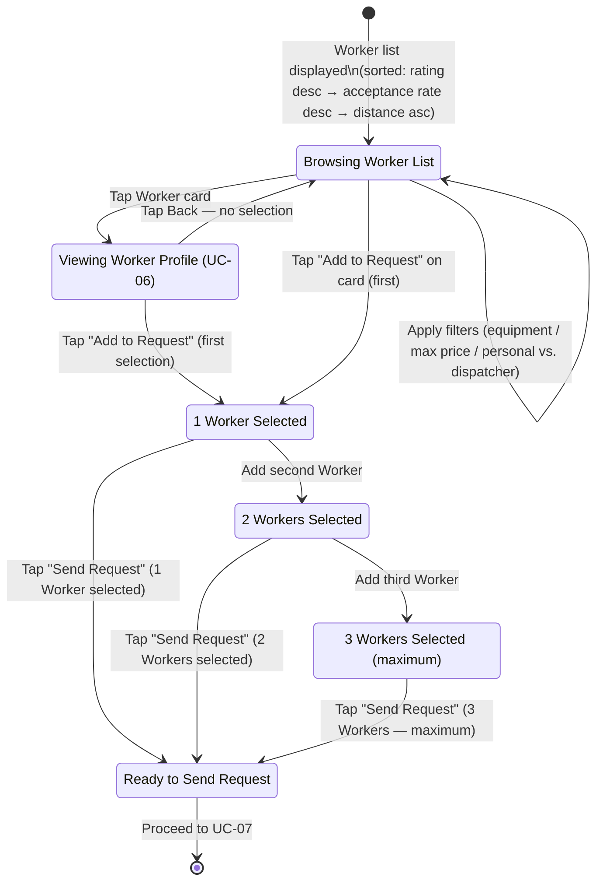

<p align="center"></p>

# USE_CASE_DIAGRAMS.md
## SnowReach — Use Case State Diagrams
**Version:** 1.0
**Date:** 2026-03-28
**Status:** Draft
**Companion documents:** USE_CASES.md v1.0 · REQUIREMENTS.md v2.3

Each diagram uses Mermaid `stateDiagram-v2` notation and shows: entity states, decision branches (alternate flows), actor-triggered transitions, and key data written at each transition. The master job state machine (all 15 job states) is in USE_CASES.md §6; individual diagrams show the subset relevant to each use case.

---

## Group A — Registration and Onboarding

---

### UC-01 · Register as Requester

**Entity:** Requester Account
**Actors:** R1/R2/R3, Firebase Auth, Stripe

```mermaid
stateDiagram-v2
    direction TB
    [*] --> EnteringDetails : User selects "Sign up as Requester"

    state "Entering Profile Details\n(name, address, DOB, auth method)" as EnteringDetails
    state "Address Validation" as AddressValidation
    state "Age Verification (DOB check)" as AgeVerification
    state "Terms and Privacy Acceptance" as TermsAcceptance
    state "Payment Method Setup (Stripe)" as PaymentSetup
    state "Active — Full Access" as Active
    state "Active — No Payment Method\n(cannot post jobs)" as ActiveNoPayment
    state "Account Created — Inactive Zone\n(matching suspended until zone launches)" as InactiveZone

    EnteringDetails --> AddressValidation : Submit form

    AddressValidation --> AgeVerification : Address geocoded; in active zone
    AddressValidation --> InactiveZone : Address outside all active zones
    AddressValidation --> EnteringDetails : Geocoding failed after all fallbacks\n[error shown; user re-enters]
    AddressValidation --> EnteringDetails : Email already registered\n[prompt to log in or reset password]

    InactiveZone --> AgeVerification : Continue registration

    AgeVerification --> TermsAcceptance : DOB confirms age ≥ 18
    AgeVerification --> [*] : Age < 18 — registration rejected

    TermsAcceptance --> PaymentSetup : ToS + Privacy Policy accepted\n[acceptance timestamped + stored immutably]

    PaymentSetup --> Active : Card validated via Stripe\n[Stripe customer ID stored]
    PaymentSetup --> ActiveNoPayment : Card validation fails; user can retry later

    Active --> [*] : Requester dashboard shown
    ActiveNoPayment --> [*] : Requester dashboard shown (limited)
    InactiveZone --> [*] : Register-interest state if zone never activates
```

**Key Data Written:** ToS acceptance timestamp, property address (geocoded), DOB (age confirmed), Stripe customer ID, property type tag (S/M/L, auto-assigned from address; user-correctable)

---

### UC-02 · Register as Personal Worker

**Entity:** Worker Account (Personal)
**Actors:** W1/W2/W3, Stripe Connect, Firebase Auth

```mermaid
stateDiagram-v2
    direction TB
    [*] --> EnteringProfile : User selects "Sign up as a Worker" → Personal

    state "Entering Profile\n(name, base address, equipment type)" as EnteringProfile
    state "Setting Distance/Price Tiers\n(1–3 tiers; max radius; buffer opt-in)" as SetTiers
    state "Stripe Connect Setup" as StripeConnect
    state "Age Verification (DOB)" as AgeVerification
    state "Terms, Age Ack, Privacy Accepted" as TermsAck
    state "Phone Verification" as PhoneVerification
    state "Active — Full Access\n(status: Available)" as ActiveFull
    state "Active — No Stripe\n(cannot accept jobs)" as ActiveNoStripe
    state "Active — No Phone\n(first job blocked)" as ActiveNoPhone
    state "Inactive — Outside Zone" as InactiveZone

    EnteringProfile --> SetTiers : Equipment declared;\nbase address saved (private — never shown to Requesters)
    SetTiers --> StripeConnect : Tiers configured;\n10% buffer opt-in set
    StripeConnect --> AgeVerification : Stripe Connect linked
    StripeConnect --> AgeVerification : Stripe Connect skipped\n[flagged; cannot accept jobs until linked]
    AgeVerification --> TermsAck : Age ≥ 18 confirmed
    AgeVerification --> [*] : Age < 18 — rejected
    TermsAck --> PhoneVerification : ToS + Age Verification + Privacy accepted\n[Onboarding module deferred to Phase 2]\n[Insurance declaration deferred to Phase 3]
    PhoneVerification --> ActiveFull : Phone verified
    PhoneVerification --> ActiveNoPhone : Skipped — first job blocked until verified
    StripeConnect --> ActiveNoStripe : Registration continues without Stripe

    ActiveFull --> [*] : Worker dashboard shown — status Available
    ActiveNoStripe --> [*] : Worker dashboard shown — jobs blocked
    ActiveNoPhone --> [*] : Worker dashboard shown — first job blocked
    InactiveZone --> [*] : Visible but not matched until zone activates
```

**Key Data Written:** equipment type, tiers (distance boundary → price per tier), max radius, buffer opt-in flag, Stripe Connect account ID, phone (verified), Worker type = Personal

**W1 (Walker):** max radius capped at 2 km; vehicle fields hidden; buffer toggle grayed
**W3 (Traveler):** effective range with buffer shown (e.g., "up to 22 km")

---

### UC-03 · Register as Dispatcher

**Entity:** Worker Account (Dispatcher)
**Actors:** W4/W5/W6, Stripe Connect, Firebase Auth

```mermaid
stateDiagram-v2
    direction TB
    [*] --> EnteringProfile : User selects "Sign up as a Worker" → Assigns to crew

    state "Entering Profile (Dispatcher type)" as EnteringProfile
    state "Entering Crew Details\n(crew size; crew member names)" as CrewDetails
    state "Dispatcher Disclosure Acknowledgement" as DispatcherAck
    state "Setting Tiers, Radius, Buffer" as SetTiers
    state "Stripe Connect + Phone + Terms" as FinishSetup
    state "Active — Dispatcher Badge Shown\n(status: Available)" as Active

    EnteringProfile --> CrewDetails : Dispatcher type selected
    CrewDetails --> DispatcherAck : Crew size + crew member names entered\n(free text; stored for on-site disclosure)
    CrewDetails --> CrewDetails : Zero crew members entered — warning shown
    DispatcherAck --> SetTiers : User acknowledges on-site disclosure obligation\n(FR-LIAB-03/04) — acknowledgement timestamped
    SetTiers --> FinishSetup : Tiers and radius configured
    FinishSetup --> Active : All verifications complete\n[Dispatcher badge stored on profile;\nvisible to Requesters before they select]
    FinishSetup --> [*] : Age < 18 at DOB check — rejected

    Active --> [*] : Worker dashboard shown — Dispatcher type visible on public profile
```

**Key Data Written:** Worker type = Dispatcher, crew list (free text), crew size, dispatcher disclosure acknowledgement timestamp
**All other registration steps** (Stripe Connect, phone, terms, age) follow UC-02.

---

## Group B — Job Posting and Discovery

---

### UC-04 · Post a Snow Clearing Job

**Entity:** Job Draft
**Actors:** R1/R2/R3

```mermaid
stateDiagram-v2
    direction TB
    [*] --> Drafting : Requester taps "Post a Job"

    state "Drafting Job\n(scope, timing note, photos)" as Drafting
    state "Address Validation" as AddressCheck
    state "Worker Availability Check" as WorkerCheck
    state "Job Draft Created" as DraftCreated

    Drafting --> AddressCheck : Requester completes scope checkboxes,\ntiming note (free text), optional photos (up to 5);\nconfirms understanding of payment model
    AddressCheck --> WorkerCheck : Address in active zone\n(pre-populated from profile or entered for alternate property)
    AddressCheck --> [*] : Address outside zone — rejected;\nRedirect to register-interest page
    WorkerCheck --> DraftCreated : Workers available within range
    WorkerCheck --> [*] : No Workers in range — options:\nwait / expand to buffer / register interest

    DraftCreated --> [*] : Proceed to UC-05 (Worker browsing)
```

**Key Data Written:** job.scope (checklist), job.timingNote, job.photos[], job.propertyAddress, job.status = Draft
**Key Data Read:** Worker availability in radius, Worker pricing tiers for applicable distance

---

### UC-05 · Browse and Filter Available Workers

**Entity:** Worker Selection (in-session)
**Actors:** R1/R2/R3



**Key Data Read:** Worker.rating, Worker.acceptanceRate, Worker.distance, Worker.priceForThisJob, Worker.equipmentType, Worker.isDispatcher, Worker.isBufferZoneOnly
**Buffer zone Workers:** card displays "Extended Range — X.X km (outside their usual area)"

---

### UC-06 · View Worker Profile

**Entity:** Worker Profile View (read-only)
**Actors:** R1/R2/R3

```mermaid
stateDiagram-v2
    direction TB
    [*] --> ProfileDisplayed : Requester taps Worker card from list

    state "Full Profile Displayed" as ProfileDisplayed

    ProfileDisplayed --> [*] : Tap "Add to Request"\n[Worker added to selection tray; return to UC-05]
    ProfileDisplayed --> [*] : Tap "Back"\n[Return to Worker list; no selection made]
```

**Key Data Read:** name, photo, equipment, service radius, pricing tiers, aggregate rating (stars + count), all review text, completed job count, dispatcher badge, trust badges (onboarding Phase 2+; background check / insured Phase 3+), buffer opt-in status
**New Worker:** "New Worker" badge shown; no rating displayed
**Below-threshold Worker:** rating shown accurately; internal Admin flag not visible to Requesters

---

## Group C — Job Selection, Booking, and Acceptance

---

### UC-07 · Send Job Request to Selected Workers

**Entity:** Job
**Actors:** R1/R2/R3, System (notification dispatch)

```mermaid
stateDiagram-v2
    direction TB
    [*] --> Dispatching : Requester taps "Send Request"

    state "Dispatching Notifications\n(simultaneous to all selected Workers)" as Dispatching
    state "Requested\n(10-min acceptance window open)" as Requested

    Dispatching --> Requested : Notifications sent to all selected Workers;\n10-min countdown begins; visible to Requester
    Dispatching --> Requested : A Worker became Unavailable between selection\nand dispatch — that Worker skipped;\nothers still receive request
    Dispatching --> [*] : All selected Workers became Unavailable\n[Requester returned to Worker list]

    Requested --> [*] : Requester cancels while Requested\n[job → Cancelled; Workers notified]
    Requested --> [*] : Proceed to UC-09 (Worker accepts/declines/times out)
```

**Key Data Written:** job.status = Requested, job.notifiedWorkers[], job.requestTimestamp, 10-min window start
**Key Data Sent to Workers:** job.scope, requester.aggregateRating, job.approxDistance, job.pricePerWorkerTier, job.timingNote

---

### UC-08 · Complete Escrow Deposit

**Phase 2 only**
**Entity:** Job, Payment
**Actors:** R1/R2/R3, Stripe

```mermaid
stateDiagram-v2
    direction TB
    [*] --> PendingDeposit : Worker accepted (UC-09);\njob in Pending Deposit state

    state "Pending Deposit\n(30-min window; countdown shown)" as PendingDeposit
    state "Payment Authorisation\n(Stripe charge)" as PayAuth
    state "Confirmed\n(escrow held; addresses disclosed; messaging open)" as Confirmed

    PendingDeposit --> PayAuth : Requester reviews summary\n(scope, Worker, price, commission disclosure,\n$10 cancellation fee warning);\nProperty damage policy acknowledged (checkbox);\ntaps "Pay"
    PendingDeposit --> [*] : Requester cancels during deposit window\n[job → Cancelled; no funds; Worker notified]
    PendingDeposit --> [*] : 30-min window expires — auto-cancel\n[job → Cancelled; Worker → Available; Worker notified]

    PayAuth --> Confirmed : Stripe charge succeeds\n[escrow held; exact addresses disclosed to both parties]
    PayAuth --> PendingDeposit : Stripe charge fails (declined / expired / fraud block)\n[failure reason shown; retry with same/different card;\ntimer continues running]

    Confirmed --> [*] : Proceed to UC-11 (Begin Work)
```

**Key Data Written:** job.status = Confirmed, job.escrowAmount, job.stripePaymentIntentId, requester.propertyDamageAckTimestamp, addresses disclosed to both parties

---

### UC-09 · Accept or Reject a Job Request

**Entity:** Job, Worker Status
**Actors:** W1–W6

```mermaid
stateDiagram-v2
    direction TB
    [*] --> NotificationReceived : Worker receives job request notification\n(within 10-min window)

    state "Notification Received\n(10-min window active)" as NotificationReceived
    state "Reviewing Job Details" as Reviewing

    NotificationReceived --> Reviewing : Worker opens notification;\nviews scope, Requester rating, distance, price, timing note

    Reviewing --> [*] : Worker taps "Accept"\n— Phase 1: job → Confirmed; addresses shared\n— Phase 2: job → Pending Deposit (UC-08);\n[Worker → Busy; other selected Workers released;\ntheir non-response NOT counted]

    Reviewing --> [*] : Worker taps "Accept Anyway" (buffer zone job)\n[extended range explicitly confirmed;\nbanner shown: "Extended Range Job — X.X km"]

    Reviewing --> [*] : Worker taps "Decline"\n[decline logged for analytics (FR-ANLT-01); no penalty;\njob stays Requested for remaining Workers]

    Reviewing --> [*] : 10-min window expires — non-response recorded\n[if 3 consecutive non-responses → Worker → Unavailable;\nRequester returned to Worker list (minus contacted Workers)]

    NotificationReceived --> [*] : Job already filled before Worker acts\n["This job has been filled" shown;\nnon-response NOT counted (FR-WORK-17)]
```

**Key Data Written (Accept):** job.assignedWorker, job.acceptTimestamp, Worker.status = Busy
**Key Data Written (Decline/Timeout):** Worker.nonResponseCount (+1 if timeout); Worker.status = Unavailable if 3rd consecutive timeout

---

### UC-10 · Negotiate Fee and Timing

**v1: display-only (no state changes) · v2: counter-offer flow**
**Entity:** Job
**Actors:** W1–W6, R1–R3

> **v1 note:** No negotiation mechanism exists. Workers see the Requester's timing note (read-only). Requesters see Workers' set prices (read-only). No state changes occur. The only recourse for either party is to decline or select a different Worker. See Gap G-01 for timing scheduling gap.

```mermaid
stateDiagram-v2
    direction TB
    [*] --> CounterOfferSent : [v2 only] Worker reviews job;\nfinds price insufficient;\nsubmits counter-offer (proposed price + optional note)

    state "Counter-Offer Sent\n(Requester notified)" as CounterOfferSent
    state "Requester Reviewing Counter-Offer" as RequesterReview

    CounterOfferSent --> RequesterReview : Requester opens counter-offer notification

    RequesterReview --> [*] : Requester Accepts\n[job proceeds at counter-offer price]
    RequesterReview --> CounterOfferSent : Requester Re-counters (up to 3 rounds total)
    RequesterReview --> [*] : Requester Rejects\n[Worker may accept original price or request expires]
    CounterOfferSent --> [*] : Round limit (3) reached\n[Worker accepts original price or request expires]
```

**Key Data Written (v2):** counterOffer.proposedPrice, counterOffer.round (1–3), counterOffer.response (accepted/rejected/re-countered), job.finalAgreedPrice

---

## Group D — Work Execution

---

### UC-11 · Begin Work (Mark In Progress)

**Entity:** Job, Liability Record, On-Site Disclosure
**Actors:** W1–W6, System (notification + challenge window)

```mermaid
stateDiagram-v2
    direction TB
    [*] --> Confirmed : Job is in Confirmed state

    state "Confirmed" as Confirmed
    state "Liability Acknowledgement Screen" as LiabilityAck
    state "On-Site Disclosure\n(Dispatcher only)" as OnSiteDisclosure
    state "Requester Challenge Window\n(15-min Accept/Decline)" as ChallengeWindow
    state "In Progress" as InProgress

    Confirmed --> LiabilityAck : Worker taps "Start Job"
    Confirmed --> [*] : Requester cancels before Worker starts\n[job → Cancelled; $10 fee Phase 2;\nWorker → Available]

    LiabilityAck --> InProgress : Personal Worker:\nAck checkbox checked; taps "Begin Work"

    LiabilityAck --> OnSiteDisclosure : Dispatcher or anyone other than account holder:\n"Someone else is performing work" checked;\nCrew member name(s) entered

    OnSiteDisclosure --> ChallengeWindow : Requester notified immediately of who is on-site;\n15-min Accept/Decline window starts

    ChallengeWindow --> InProgress : Requester taps "Accept"\nor 15-min window expires (auto-accept);\n[job → In Progress; liability ack + disclosure stored immutably]

    ChallengeWindow --> Confirmed : Requester taps "Decline" (unknown person)\n[job reverts to Confirmed; NO cancellation fee;\nWorker can correct disclosure or submit Cannot Complete]

    InProgress --> [*] : Proceed to UC-12 (Mark Complete) or UC-13 (Cannot Complete)
```

**Key Data Written:** job.status = InProgress, job.inProgressTimestamp, liabilityAck.actorId, liabilityAck.timestamp, onSitePersonnel[].name (if dispatcher), onSitePersonnel[].notifiedRequester = true

---

### UC-12 · Complete Work (Mark Complete)

**Entity:** Job, Dispute Windows
**Actors:** W1–W6

```mermaid
stateDiagram-v2
    direction TB
    [*] --> InProgress : Job is In Progress

    state "In Progress" as InProgress
    state "Photo Upload Step\n(optional; up to 5 photos)" as PhotoUpload
    state "Complete\n(quality window 2hr; damage window 24hr)" as Complete

    InProgress --> PhotoUpload : Worker taps "Mark Complete"
    InProgress --> [*] : Worker cannot finish — see UC-13 (Cannot Complete)

    PhotoUpload --> Complete : Worker taps "Confirm Completion"\n[photos uploaded successfully]
    PhotoUpload --> Complete : Worker skips photo upload (non-blocking)\nor upload fails (non-blocking)\n[flagged: "No completion photos" — visible to Admin and Requester]

    Complete --> [*] : 2-hr quality window and 24-hr damage window both begin;\nRating prompt queued (fires 1hr after terminal state);\nRequester notified;\nProceed to UC-14 (Acknowledge) or UC-15 (Dispute)
```

**Key Data Written:** job.status = Complete, job.completeTimestamp, job.completionPhotos[], qualityWindowExpiry = completeTimestamp + 2hr, damageWindowExpiry = completeTimestamp + 24hr

---

### UC-13 · Report Cannot Complete

**Entity:** Job, Worker Status, Cannot Complete Record
**Actors:** W1–W6

```mermaid
stateDiagram-v2
    direction TB
    [*] --> InProgress : Job is In Progress

    state "In Progress" as InProgress
    state "Reason Selection\n(mandatory)" as ReasonSelection
    state "Incomplete\n(messaging open; 24-hr Requester window)" as Incomplete
    state "Released (terminal)" as Released
    state "Refunded (terminal)" as Refunded

    InProgress --> ReasonSelection : Worker taps "Cannot Complete"
    ReasonSelection --> Incomplete : Reason selected (Equipment failure /\nSafety concern / Property access blocked /\nWeather / Other);\nOptional note (max 500 chars);\nWorker taps "Submit" (irreversible);\n[Worker → Available; both parties notified;\nmessaging thread stays open]

    Incomplete --> Released : Requester taps "Accept Outcome"\n[meaningful work completed; standard disbursement 85%/15%]
    Incomplete --> Refunded : Requester taps "Request Refund"\n[full refund; no fault assigned]
    Incomplete --> Refunded : 24-hr window expires — auto-refund fires
    Incomplete --> [*] : Requester taps "Raise Dispute"\n[dispute type pre-set as "Incomplete work";\nCannot Complete reason code + note included in evidence;\nProceed to UC-15]

    Released --> [*]
    Refunded --> [*]
```

**Key Data Written:** job.status = Incomplete, cannotComplete.reason, cannotComplete.note, cannotComplete.timestamp, Worker.cannotCompleteRate (+1); if 3rd incident within 90 days → Admin review flag auto-created (FR-JOB-14)

---

## Group E — Completion Acknowledgement and Dispute

---

### UC-14 · Acknowledge Completion

**Entity:** Job, Payment
**Actors:** R1/R2/R3, System (auto-release timer)

```mermaid
stateDiagram-v2
    direction TB
    [*] --> Complete : Job marked Complete (UC-12);\nboth dispute windows now active

    state "Complete\n(2-hr quality window; 24-hr damage window)" as Complete
    state "Released (terminal)" as Released

    Complete --> Released : Requester taps "Approve and Release"\n[Phase 1: card charged; Phase 2: escrow released;\nWorker receives 85% within 2–3 business days;\nRating prompt queued for 1hr after terminal]

    Complete --> Released : 2-hr quality window expires — auto-release fires\n[same disbursement; rating prompt queued]

    Complete --> [*] : Requester raises dispute within applicable window\n[Proceed to UC-15]

    Released --> [*]
```



**Key Data Written:** job.status = Released, job.releaseTimestamp, payment.workerShare = price × 0.85, payment.platformFee = price × 0.15

---

### UC-15 · Initiate and Process a Dispute

**Entity:** Job, Dispute Record, Payment
**Actors:** R1–R3 (file), W1–W6 (respond), A1 (rule), System

*Five sequential stages. Each diagram picks up where the previous ends.*

---

**Stage 1 — Dispute Initiation (Requester)**

```mermaid
stateDiagram-v2
    direction TB
    [*] --> Complete : Job in Complete state

    state "Complete\n(within dispute window)" as Complete
    state "Awaiting Worker Response\n(funds frozen / payment paused)" as AwaitingResponse

    Complete --> AwaitingResponse : Requester taps "Raise a Dispute"\n[within quality window (2hr) or damage window (24hr)];\ndispute type selected (quality / damage / both);\ndescription + up to 5 photos submitted;\n[Phase 2: escrow frozen; Phase 1: payment collection paused]

    Complete --> [*] : Dispute window has expired\n[system rejects attempt; Requester informed;\nfunds already released]
```



---

**Stage 2 — Worker Response (48-hour window)**

```mermaid
stateDiagram-v2
    direction TB
    [*] --> AwaitingResponse : Stage 1 complete

    state "Awaiting Worker Response\n(48-hr window)" as AwaitingResponse
    state "Refunded (terminal)" as Refunded
    state "Admin Review\n(up to 5 business days)" as AdminReview

    AwaitingResponse --> Refunded : Worker accepts dispute in full\n[immediate full refund to Requester; irrevocable;\nbypasses Admin Review]

    AwaitingResponse --> AdminReview : Worker submits response\n[written account, up to 5 photos, optional proposed settlement]

    AwaitingResponse --> AdminReview : 48-hr window expires — non-response\n[non-response flagged in Worker record;\ncase proceeds to Admin Review automatically]

    Refunded --> [*]
```



---

**Stage 3 — Admin Review (up to 5 business days)**

```mermaid
stateDiagram-v2
    direction TB
    [*] --> AdminReview : Evidence package compiled:\noriginal job + photos; completion photos; dispute description + photos;\nWorker response; full job timeline; on-site disclosure;\nboth parties' dispute rates and fraud flags

    state "Admin Review\n(up to 5 business days)" as AdminReview
    state "Return Pending\n(Worker must return within 24hr)" as ReturnPending
    state "Appeal Window\n(48-hr window opens)" as AppealWindow

    AdminReview --> ReturnPending : Ruling: Return to Complete\n[Worker notified with 24hr deadline; funds held]

    AdminReview --> AppealWindow : Ruling: Full payment to Worker\n[85%/15% disbursement pending appeal window]

    AdminReview --> AppealWindow : Ruling: Full refund to Requester\n[100% refund pending appeal window]

    AdminReview --> AppealWindow : Ruling: Partial split\n[proportional award pending appeal window]

    AdminReview --> AppealWindow : Ruling: Increased payment\n[Requester invited to authorise additional charge;\nif Requester declines → ruling on original escrowed amount]
```

---

**Stage 4 — Return to Complete (if applicable)**

```mermaid
stateDiagram-v2
    direction TB
    [*] --> ReturnPending : Ruling: Worker must return within 24hr

    state "Return Pending\n(24-hr window)" as ReturnPending
    state "In Progress (return visit)\n(liability reacknowledged)" as InProgressReturn
    state "Complete (return)\n(new 2-hr quality window)" as CompleteReturn
    state "Refunded (terminal)" as Refunded

    ReturnPending --> InProgressReturn : Worker returns; taps "Start Job";\nliability acknowledgement repeated
    ReturnPending --> Refunded : Worker fails to return within 24hr\n[ruling auto-converts to full refund to Requester]

    InProgressReturn --> CompleteReturn : Worker marks Complete again

    CompleteReturn --> [*] : Requester approves → Released\nor re-disputes within new 2-hr window → UC-15 restarts

    Refunded --> [*]
```

---

**Stage 5 — Appeal Window and Final Ruling**

```mermaid
stateDiagram-v2
    direction TB
    [*] --> AppealWindow : Admin ruling issued

    state "Appeal Window\n(48 hours)" as AppealWindow
    state "Appeal Review\n(designated senior Admin; 3-business-day target)" as AppealReview
    state "Released (terminal)" as Released
    state "Refunded (terminal)" as Refunded
    state "Settled (terminal)" as Settled

    AppealWindow --> Released : No appeal; ruling favours Worker → executed
    AppealWindow --> Refunded : No appeal; ruling favours Requester → executed
    AppealWindow --> Settled : No appeal; partial split → executed
    AppealWindow --> AppealReview : Either party files appeal within 48hr\n[grounds: new evidence / procedural error / factual error;\nfrivolous appeal noted on account]

    AppealReview --> Released : Final ruling for Worker (no further appeal)
    AppealReview --> Refunded : Final ruling for Requester (no further appeal)
    AppealReview --> Settled : Final ruling — partial split (no further appeal)

    Released --> [*]
    Refunded --> [*]
    Settled --> [*]
```



**Key Data Written:** dispute.type, dispute.description, dispute.photos[], dispute.ruling, dispute.rulingTimestamp, dispute.appealFiled, dispute.finalRuling; both parties' disputeRate metrics updated; all records immutably stored 7 years
**App Owner role:** read-only access to all records; may direct reconsideration in exceptional circumstances; does not issue rulings directly

---

### UC-16 · Cancel a Job

**Entity:** Job, Payment
**Actors:** R1–R3 or W1–W6 (initiator), System (auto-cancel timer)

```mermaid
stateDiagram-v2
    direction TB
    [*] --> CancelCheck : Either party initiates cancellation\nor auto-cancel timer fires

    state "Evaluate Current Job State" as CancelCheck
    state "Cancelled (terminal)" as Cancelled

    CancelCheck --> Cancelled : From Requested (before any Worker accepts)\n[no funds; both parties notified]

    CancelCheck --> Cancelled : From Pending Deposit — Requester cancels during window\n[no funds; Worker notified; Worker → Available]

    CancelCheck --> Cancelled : From Pending Deposit — 30-min window auto-expires\n[no funds; Worker notified; Worker → Available]

    CancelCheck --> Cancelled : From Confirmed — Phase 1\n[full refund; no cancellation fee;\nWorker → Available; Worker cancellation rate updated if Worker-initiated]

    CancelCheck --> Cancelled : From Confirmed — Phase 2\n[$10 cancellation fee deducted from escrow;\nremainder refunded to Requester within 2–3 business days;\nWorker → Available; cancellation rate updated if Worker-initiated]

    CancelCheck --> [*] : From In Progress or beyond\n[BLOCKED — cancellation not permitted;\nDispute process (UC-15) is the applicable mechanism]

    Cancelled --> [*]
```

**Key Data Written:** job.status = Cancelled, cancellation.initiator, cancellation.timestamp, cancellation.fee ($10 or $0), Worker.cancellationRate (+1 if Worker-initiated from Confirmed), Worker.status = Available

---

## Group F — Feedback and Tip

---

### UC-17 · Leave Feedback and Rating

**Entity:** Rating Record, Worker Aggregate Rating
**Actors:** R1–R3 and W1–W6 (independently), System (threshold checks)

```mermaid
stateDiagram-v2
    direction TB
    [*] --> TerminalReached : Job reaches terminal state\n(Released / Refunded / Settled / Cancelled-if-work-began)

    state "Terminal State" as TerminalReached
    state "Rating Prompt Queued\n(fires 1hr after terminal state)" as PromptQueued
    state "Rating Collection\n(7-day window; both parties independent)" as RatingCollection
    state "Ratings Published\n(simultaneously to both profiles)" as RatingsPublished
    state "Threshold Check\n(Worker aggregate recalculated)" as ThresholdCheck

    TerminalReached --> PromptQueued : System queues rating prompts for both parties
    PromptQueued --> RatingCollection : Prompts sent simultaneously

    RatingCollection --> RatingsPublished : Both parties submit within 7 days\n[ratings collected independently;\npublished simultaneously]
    RatingCollection --> RatingsPublished : 7-day window expires\n[non-submitting party: "No rating submitted";\nother party's rating published regardless]

    RatingsPublished --> ThresholdCheck : Worker aggregate rating recalculated

    ThresholdCheck --> [*] : Aggregate ≥ 4.0 — no action
    ThresholdCheck --> [*] : Aggregate < 4.0 (min 10 jobs)\n→ Admin flag created (internal; not shown to Requesters)
    ThresholdCheck --> [*] : Aggregate < 3.5 (min 10 jobs)\n→ Worker suspended from new jobs;\nAdmin review required before reinstatement
```

**Key Data Written:** rating.stars (1–5), rating.reviewText, rating.submittedAt (per party); Worker.aggregateRating recalculated; analytics: FR-ANLT-06/09/11

---

### UC-18 · Leave a Tip

**v1.1 only**
**Entity:** Tip Payment
**Actors:** R1/R2/R3, Stripe

```mermaid
stateDiagram-v2
    direction TB
    [*] --> TipPrompt : Requester has submitted or skipped rating (UC-17)

    state "Tip Prompt Displayed\n($5 / $10 / $20 presets + custom entry)" as TipPrompt
    state "Tip Charge Processing\n(Stripe; separate charge; immediate)" as TipCharging

    TipPrompt --> TipCharging : Requester selects amount\n[100% to Worker; no commission;\nnot held in escrow; charged immediately]
    TipPrompt --> [*] : Requester taps Skip or exits\n[no tip recorded; no penalty; no follow-up prompt]

    TipCharging --> [*] : Charge succeeds\n[Worker notified; tip recorded in job record;\ndisbursed within standard Stripe payout timeline]
    TipCharging --> TipPrompt : Charge fails\n[Requester prompted to retry;\nno effect on job record, rating, or fund release]
```

**Key Data Written:** job.tip.amount, job.tip.stripeChargeId, job.tip.timestamp

---

## Group G — Messaging

---

### UC-19 · In-App Messaging and Job Revocation

**Entity:** Message Thread
**Actors:** W1–W6, R1–R3

```mermaid
stateDiagram-v2
    direction TB
    [*] --> ThreadOpen : Job reaches Confirmed state (Phase 2)\nor Worker accepts (Phase 1)

    state "Thread Open\n(real-time via Firebase Firestore)" as ThreadOpen
    state "Thread Archived — Read Only\n(retained for dispute evidence; 7-year retention)" as ThreadArchived
    state "Cancelled (terminal)" as Cancelled

    ThreadOpen --> ThreadOpen : Either party sends text message\n[real-time delivery; in-app + email notification;\npersistent "no contact info" notice shown]

    ThreadOpen --> ThreadOpen : Job transitions through non-terminal states\n(In Progress / Complete / Incomplete / Awaiting Response / Admin Review etc.)\n[thread remains open throughout]

    ThreadOpen --> Cancelled : Either party taps "Revoke Job" and confirms\n[From Confirmed: $10 cancellation fee applies (Phase 2);\nFrom Requested: no charge;\ntransition per UC-16 cancellation rules]

    ThreadOpen --> ThreadArchived : Job reaches any terminal state\n(Released / Refunded / Settled / Cancelled)\n[thread closed to new messages;\nboth parties retain read access from job history]

    Cancelled --> ThreadArchived : Thread archived on cancellation
    ThreadArchived --> [*]
```

**Key Data Written:** message.senderId, message.text, message.timestamp (all messages stored immutably); messages included in dispute evidence package if dispute filed on this job
**Dispatcher use (W4/W5/W6):** messaging supplements the formal on-site disclosure — Dispatcher can use thread to communicate crew ETA and identity before work begins

---

## Group G (continued) — Payment Exceptions

---

### UC-20 · Timer-Based Auto-Operation Failure

**Entity:** Scheduled Timer, Payment Operation, Job State
**Actors:** System, A1

*Three timers drive automatic state transitions: auto-release (Complete → Released, 4hr), auto-cancel (Pending Deposit → Cancelled, 30min), auto-refund (Incomplete → Refunded, 24hr).*

```mermaid
stateDiagram-v2
    direction TB
    [*] --> TimerFires : Scheduled timer fires at correct time

    state "Timer Fires" as TimerFires
    state "Stripe Operation Attempted" as StripeAttempt
    state "Retry\n(up to 3x; exponential backoff)" as Retry
    state "Payment Exception\nAdmin Queue" as AdminQueue
    state "State Transition Succeeded\n(job moves to terminal state)" as Succeeded

    TimerFires --> StripeAttempt : System initiates Stripe operation\n(release / cancel / refund)
    StripeAttempt --> Succeeded : Stripe operation succeeds
    StripeAttempt --> Retry : Stripe error (5xx / timeout / network failure)\n[job remains in current state]
    Retry --> Succeeded : Retry succeeds
    Retry --> AdminQueue : All 3 retries fail\n[job label: "Payment Processing Delayed" (Admin-only);\njob remains in current state for users;\nAdmin alerted by email]
    AdminQueue --> Succeeded : Admin manually triggers operation\nor Stripe recovers + Admin retries;\nor Admin extends window if warranted

    Succeeded --> [*]

    [*] --> PlatformRestart : Platform restart or crash while timer is pending
    state "Platform Restart Recovery" as PlatformRestart
    PlatformRestart --> TimerFires : Timer already past fire time\n→ execute immediately on recovery
    PlatformRestart --> [*] : Timer not yet due\n→ resume from remaining duration\n[durable scheduler reads pending timers from database]
```

**Key Data Written:** paymentException.jobId, paymentException.timerType, paymentException.failureReason, paymentException.timestamp; Admin alert sent; all pending timers persisted to database (durable scheduling, FR-PAY-13)

---

### UC-21 · Stripe API Outage

**Entity:** Platform Payment Mode, All Active Job States
**Actors:** System, A1

```mermaid
stateDiagram-v2
    direction TB
    [*] --> OutageDetected : 3+ consecutive Stripe API errors\nwithin a 5-minute window (FR-PAY-17)

    state "Outage Detected" as OutageDetected
    state "Payment-Suspended Mode\n(all pending Stripe ops queued;\nall timers frozen at remaining duration)" as SuspendedMode
    state "Recovery Detected\n(Stripe test call succeeds)" as RecoveryDetected
    state "Normal Operation\n(queue flushed; timers resumed)" as NormalOperation

    OutageDetected --> SuspendedMode : Platform enters Payment-Suspended mode;\nAdmin alerted immediately;\naffected users notified of delay by state

    SuspendedMode --> SuspendedMode : New Stripe operations queued internally;\njob states unchanged;\ntimers frozen at remaining duration

    SuspendedMode --> RecoveryDetected : Stripe test call succeeds

    RecoveryDetected --> NormalOperation : Queued operations executed in order (oldest-first)\nwith idempotency keys;\ntimers resume from remaining duration;\nAdmin receives recovery notification;\naffected users notified "payment processing resumed"

    NormalOperation --> [*]
```

**User-visible effects by state:**
- Requested / Confirmed / In Progress: unaffected (no payment action needed yet)
- Pending Deposit: "Payment processing temporarily unavailable — 30-min window paused"
- Complete: auto-release timer paused (Admin aware; users see no change)
- Incomplete: auto-refund timer paused; Requester notified of delay
- Awaiting resolution / Admin Review: unaffected (no payment action until ruling)

---

### UC-22 · Escrow Deposit or Post-Completion Charge Failure

**Entity:** Payment, Job State
**Actors:** R1–R3, System, A1

**Phase 2 — Escrow Deposit Failure:**

```mermaid
stateDiagram-v2
    direction TB
    [*] --> PendingDeposit : Phase 2: Worker accepted;\ndeposit required within 30-min window

    state "Pending Deposit\n(30-min window running)" as PendingDeposit
    state "Requester Retrying\n(same/different card)" as P2Retry
    state "Confirmed" as Confirmed
    state "Cancelled (terminal)" as Cancelled

    PendingDeposit --> P2Retry : Charge fails (declined / expired / insufficient funds /\nfraud prevention block);\nfailure reason shown from Stripe;\ntimer continues running
    P2Retry --> Confirmed : Retry succeeds → job confirmed; escrow held
    P2Retry --> P2Retry : Retry fails again; further retry attempts allowed
    P2Retry --> Cancelled : 30-min window expires during retries\n[auto-cancel; Worker → Available]
    PendingDeposit --> Cancelled : 30-min window expires without payment attempt\nor Requester cancels explicitly

    Confirmed --> [*]
    Cancelled --> [*]
```

**Phase 1 — Post-Completion Charge Failure:**

```mermaid
stateDiagram-v2
    direction TB
    [*] --> Complete : Phase 1: Worker marks Complete;\nplatform immediately attempts to charge Requester's card

    state "Complete — Charge Attempted" as Complete
    state "Retrying Charge\n(up to 3 attempts over 24hr)" as P1Retry
    state "Payment Exception — Admin Queue" as P1AdminQueue
    state "Released (terminal)" as Released

    Complete --> Released : Charge succeeds immediately → funds disbursed
    Complete --> P1Retry : Charge fails (declined / expired / other error)
    P1Retry --> Released : Retry succeeds
    P1Retry --> P1AdminQueue : All retries fail\n[Worker notified of delay;\nRequester notified to update payment method;\nAdmin alerted]
    P1AdminQueue --> Released : Admin contacts Requester; card updated; charge retried
    P1AdminQueue --> [*] : Unresolvable → bad-debt process (Admin determination)

    Released --> [*]
```

> **Phase 1 risk:** Because Phase 1 has no pre-job escrow, a permanent charge failure means the Worker may not receive payment for completed work. This is the primary motivation for Phase 2 escrow.

---

### UC-23 · Worker Payout Failure

**Entity:** Stripe Connect Payout, Worker Account
**Actors:** W1–W6, System, A1

```mermaid
stateDiagram-v2
    direction TB
    [*] --> PayoutAuthorised : Disbursement authorised\n(job Released or Settled)

    state "Payout Authorised\n(Stripe Connect transfer initiated)" as PayoutAuthorised
    state "Payout Failure\n(exception created; Admin + Worker notified)" as PayoutFailure
    state "Awaiting Worker Action\n(update Stripe Connect account)" as AwaitingWorker
    state "Payout Succeeded" as PayoutSucceeded
    state "Escalated — App Owner\nLegal/Compliance Process" as Escalated

    PayoutAuthorised --> PayoutSucceeded : Transfer succeeds (immediate or delayed-webhook)
    PayoutAuthorised --> PayoutFailure : Payout fails:\nStripe Connect not fully set up /\nbank account closed or hard-rejected /\nStripe account suspended /\nbank return after initial acceptance (webhook)

    PayoutFailure --> AwaitingWorker : Admin queue exception created;\nWorker notified: "Payout of $X could not be delivered;\nplease check your Stripe account";\nAdmin alerted

    AwaitingWorker --> PayoutSucceeded : Worker updates Stripe Connect;\nWorker or Admin retries → succeeds

    AwaitingWorker --> Escalated : 90 days with no Worker response\n[funds held in Admin-controlled state;\nWorker account may be suspended]

    Escalated --> [*] : Legal/compliance process; App Owner involved
    PayoutSucceeded --> [*]
```

**Key Data Written:** payoutException.workerId, payoutException.amount, payoutException.failureReason, payoutException.timestamp; funds never lost — held by Stripe/Admin until successfully delivered or legally resolved

---

### UC-24 · Duplicate or Erroneous Charge

**Entity:** Stripe Charge, Job Payment Record
**Actors:** R1–R3, System, A1

```mermaid
stateDiagram-v2
    direction TB
    [*] --> ChargeSubmitted : Platform submits Stripe charge\n(deposit, completion charge, or tip)

    state "Charge Submitted" as ChargeSubmitted
    state "Idempotency Match\n(same key — no new charge)" as IdempotencyMatch
    state "Charge Succeeded\n(single charge)" as ChargeSucceeded
    state "Duplicate Detected\n(platform bug: two different keys, same job + amount + time window)" as DuplicateDetected
    state "Auto-Refund Initiated\n(duplicate charge refunded immediately)" as AutoRefund

    ChargeSubmitted --> IdempotencyMatch : Platform retries with same idempotency key\n(network timeout scenario)
    IdempotencyMatch --> ChargeSucceeded : Stripe returns original result; no new charge;\nno user impact

    ChargeSubmitted --> ChargeSucceeded : First (and only) submission succeeds

    ChargeSubmitted --> DuplicateDetected : Platform bug submits two charges\nwith different idempotency keys;\nboth succeed at Stripe;\nplatform detects: same Requester + job ID + amount within 5 min (FR-PAY-21)

    DuplicateDetected --> AutoRefund : Stripe refund initiated immediately for duplicate;\nRequester notified: "Duplicate charge automatically refunded";\nAdmin alerted; both charge IDs logged;\ndevelopment team notified via incident log

    AutoRefund --> [*] : Requester made whole; no financial loss to any party
    ChargeSucceeded --> [*]
```

**Client-side guard:** Pay button disabled after first tap to prevent double-submission
**Server-side guard:** Idempotency key prevents double-execution even if client guard bypassed (e.g., direct API call)

**Key Data Written:** charge.idempotencyKey, duplicate.chargeIds[] (if applicable), duplicate.refundId, incident.logEntry

---

### UC-25 · Refund Processing Failure

**Entity:** Stripe Refund, Job Payment Record
**Actors:** R1–R3, System, A1, App Owner

```mermaid
stateDiagram-v2
    direction TB
    [*] --> RefundAuthorised : Refund authorised\n(dispute ruling / Cannot Complete auto-refund / cancellation)

    state "Refund Authorised\n(Stripe refund initiated)" as RefundAuthorised
    state "Retry\n(up to 3x; exponential backoff)" as Retry
    state "Payment Exception — Admin Queue" as AdminQueue
    state "Refund Succeeded" as RefundSucceeded
    state "Platform Credit Applied\n(to next job deposit)" as PlatformCredit
    state "Manual Bank Transfer\n(App Owner executes e-transfer)" as ManualTransfer
    state "Unclaimed Funds\n(Ontario Unclaimed Intangible Property Act)" as UnclaimedFunds

    RefundAuthorised --> RefundSucceeded : Stripe refund succeeds
    RefundAuthorised --> Retry : Stripe refund fails\n(over-refund / card account closed / refund limit)

    Retry --> RefundSucceeded : Retry succeeds
    Retry --> AdminQueue : All 3 retries fail\n[Admin alerted;\nRequester notified: "We'll contact you within 2 business days"]

    AdminQueue --> RefundSucceeded : AF-1: Stripe returns "charge already fully refunded"\n[exception closed; Requester notified refund is complete]

    AdminQueue --> PlatformCredit : Admin offers platform credit;\nRequester agrees
    AdminQueue --> ManualTransfer : Admin offers e-transfer;\nRequester provides banking details via secure channel;\nApp Owner executes

    AdminQueue --> UnclaimedFunds : Requester account closed; no contact possible\n[funds retained per provincial unclaimed property regulations]

    PlatformCredit --> [*] : Exception closed; Requester made whole
    ManualTransfer --> [*] : Exception closed; Requester made whole
    RefundSucceeded --> [*]
    UnclaimedFunds --> [*]
```

**Platform commitment:** Requester receives their entitled refund through some mechanism. Platform does not retain funds owed to the Requester beyond the resolution period.

**Key Data Written:** refundException.jobId, refundException.amount, refundException.failureReason, refundException.resolution, refundException.closedAt

---

*End of USE_CASE_DIAGRAMS.md — v1.0 — 25 use cases covered*
